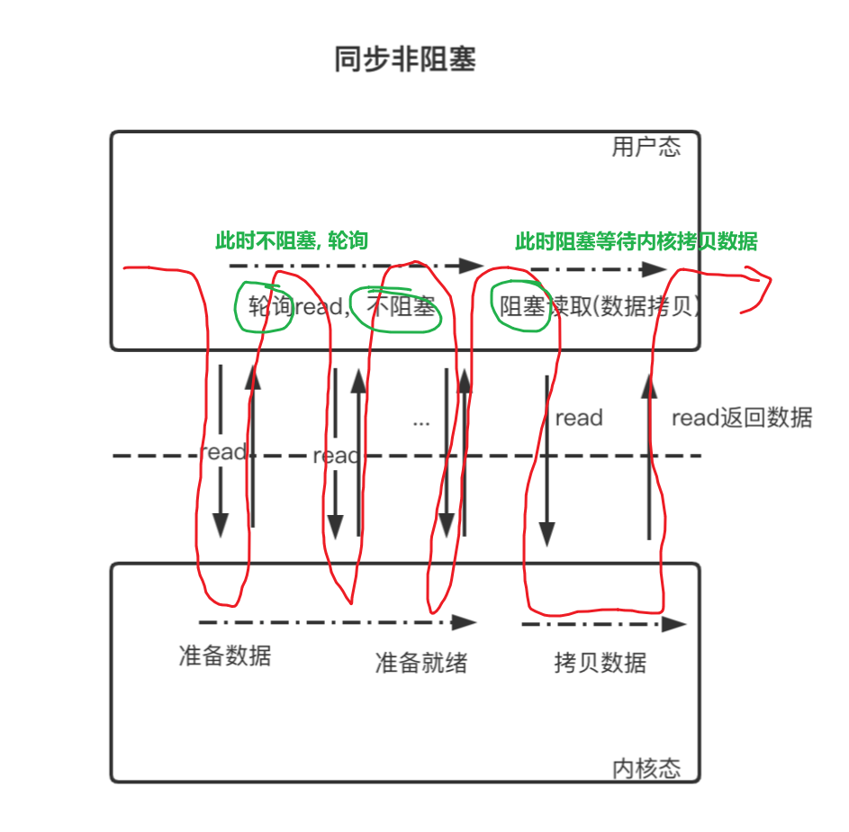

# I/O?

**I/O是什么？**

>   I/O 就是计算机内存与外部设备之间拷贝数据的过程，CPU 访问内存的速度远远高于外部设备，因此 CPU 是先把外部设备的数据读到内存里，然后再进行处理

**I/O模型要解决的问题**

-   考虑一个实际场景：数据读取操作的基本流程，首先是在==用户态==发起调用操作，通过系统函数read()间接的调用系统内核，从网卡读取数据，先将数据读取到内核缓冲区，再由内核缓冲区拷贝到用户态内存缓冲区
-   在这个过程中，涉及到cpu的操作、内存操作、外部物理设备操作；由于三者数据处理速度的巨大差异性，用户读取数据时，采用 用户线程阻塞等待？非阻塞轮询查询并读取数据？还是由内核回调通知？这些便是I/O模型要解决的问题

**I/O 模型的区别**
当用户线程发起 I/O 操作后，网络数据读取操作会经历两个步骤：

-   用户线程等待内核将数据从网卡拷贝到内核空间。
-   内核将数据从内核空间拷贝到用户空间

各种 I/O 模型的区别就是：它们实现这两个步骤的方式是不一样的


# 4种主要的IO模型

### 1. 同步阻塞IO

用户线程发起 read( ) 调用后就==阻塞==了，让出 CPU。内核等待网卡数据到来，把数据从网卡拷贝到内核空间，接着把数据拷贝到用户空间，再把用户线程叫醒


### 2. 同步非阻塞IO

用户线程不断的发起 read 调用，==轮询==内核空间是否有数据, 数据没到内核空间时，每次都返回失败，直到数据到了内核空间，这一次 read 调用后，在等待数据从内核空间拷贝到用户空间这段时间里，线程还是阻塞的，等数据到了用户空间再把线程叫醒

需要注意的是：这里通过用户线程自己去轮询读取数据，和I/O多路复用使用专用的线程去轮询处理(通常一个线程)不同:	用户线程轮询发起read操作，如果数据未就绪，则立即返回；如正好数据准备就绪，则阻塞等待数据从内核拷贝到用户空间，再唤醒用户线程，read调用返回



### 3. IO多路复用

用户线程的==读取操作分成两步==了，线程先发起 select 调用，目的是问内核数据准备好了吗？等内核把数据准备好了，用户线程再发起 read 调用。在等待数据从内核空间拷贝到用户空间这段时间里，线程还是阻塞的。

那为什么叫 I/O 多路复用呢？因为一个专用线程轮询发起 select 调用可以向内核查多个数据通道（Channel）的状态，也就是一个线程监听多个内核数据通道的状态,  这些内核数据通道一旦有数据,  立刻发起 read 调用


-   IO多路复用模型的基本原理就是select/epoll系统调用，单个线程不断的轮询select/epoll系统调用所负责的成百上千的socket连接，当某个或者某些socket网络连接有数据到达了，就返回这些可以读写的连接
-   这里select也是IO操作
-   首先发起select操作，如果检测到有通道数据准备就绪，则再发起一次read操作；CPU由用户态切换到内核态，执行内核代码，将用户线程挂起，然后把数据从内核空间拷贝到用户空间，再唤醒用户线程，read调用返回


### 4. 异步I/O

用户线程发起 read 调用的同时注册一个回调函数，read 立即返回，等内核将数据准备好后，再调用指定的==回调==函数完成处理。在这个过程中，用户线程一直没有阻塞


## 总结

-   阻塞和非阻塞: 阻塞I/O在调用read后阻塞等待内核接收数据, 非阻塞I/O只是不会阻塞等待内核, 在内核有数据并拷贝到用户空间的时候还是会阻塞
-   同步非阻塞和I/O多路复用: 相同点: 都使用了轮询的方式来监听内核是否接收了数据; 不同点, 一个使用不停调用read函数的方式来轮询, 一个使用专门的线程调用Select来监听内核
-   同步和异步:     指应用程序在与内核通信时数据从内核空间拷贝到应用空间，是由内核主动发起还是由应用程序来触发；内核主动发起则是异步{ 拷贝数据和用户态请求是异步的 }，反之为同步{ 拷贝数据和用户态请求同步 }


# I/O多路复用模型

所谓 IO多路复用指的是用一个用户线程就可以查询所有套接字（文件描述符）数据是否准备就绪，所以，这里看到会分两步走：

1.   先查询哪些文件描述符对应的 IO 事件准备就绪了，这里的查询可以通过 select、poll、epoll 等系统调用
2.   再将准备就绪的套接字，通过 read 或者 write 等系统调用进行实际的读写操作。


问题:

-   第一，多路复用机制会监听套接字上的哪些事件？
-   第二，多路复用机制可以监听多少个套接字？
-   第三，当有套接字就绪时，多路复用机制要如何找到就绪的套接字？


## select 机制实现 IO 多路复用

`select`方法定义：

```c++
int select (int __nfds, 
            fd_set *__readfds, 
            fd_set *__writefds, 
            fd_set *__exceptfds, 
            struct timeval *__timeout
           )
```


具体参数有：

-   监听的文件描述符数量 `__nfds`

-   被监听描述符的三个集合 `__readfds`、`__writefds `和 `__exceptfds`

-   监听时阻塞等待的超时时长 __timeout。

    

值得注意的是，Unix 哲学中，一切皆文件。 因此，Linux 针对每一个套接字都会有一个文件描述符，也就是一个非负整数，用来唯一标识该套接字。所以，在多路复用机制的函数中，Linux 通常会用**文件描述符作为参数**。有了**文件描述符，函数也就能找到对应的套接字**，进而进行监听、读写等操作。

在方法参数中，被监听描述符的集合，其实就是被监听套接字的集合。那么，为什么会有三个集合呢？

这就和刚才提出的第一个问题相关，也就是多路复用机制会监听哪些事件。==**select 函数使用三个集合，表示监听的三类事件，分别是 读数据事件、写数据事件、异常事件**==。

我们进一步可以看到，三个被监听的集合的类型是 fd_set 结构体，它主要定义部分如下所示：

```c++
typedef struct {
   …
   __fd_mask  __fds_bits[__FD_SETSIZE / __NFDBITS];
   …
} fd_set
```


其中：

​	`__fd_mask` 类型是 long int 类型的别名
​	`__FD_SETSIZE` 和` __NFDBITS` 这两个宏定义的大小默认为 1024 和 32

所以，fd_set 结构体的定义，其实就是一个 long int 类型的数组，该数组中一共有 32 个元素（1024/32=32），每个元素是 32 位（long int 类型的大小），而每一位可以用来表示一个文件描述符的状态。

了解了 fd_set 结构体的定义，我们就可以回答刚才提出的第二个问题了。==**select 函数对每一个描述符集合，都可以监听 1024 个描述符。**==


接下来，我们再来了解下如何使用 select 机制来实现网络通信。

`select  ->  bind  ->  lisen  ->  accept  ->  read/write  ->  close`

**1）首先，通过 select 查询哪些套接字处于就绪状态：**

首先，我们在调用 select 函数前，可以先创建好传递给 select 函数的文件描述符集合，然后再创建监听套接字。而为了让创建的监听套接字能被 select 函数监控，我们需要把这个套接字的描述符加入到创建好的描述符集合中。

然后，我们就可以调用 select 函数，并把创建好的描述符集合作为参数传递给 select 函数。程序在调用 select 函数后，会发生阻塞。

而当 select 函数检测到有描述符就绪后，就会结束阻塞，并返回就绪的文件描述符个数。那么此时，我们就可以在描述符集合中查找哪些描述符就绪了。然后，我们对已就绪描述符对应的套接字进行处理。

**2）然后，通过系统调用读、写数据：**

比如，如果是 __readfds 集合中有描述符就绪，这就表明这些就绪描述符对应的套接字上，有读事件发生，此时，我们就在该套接字上读取数据。

而因为 select 函数一次可以监听 1024 个文件描述符的状态，所以 select 函数在返回时，也可能会一次返回多个就绪的文件描述符。这样一来，我们就可以使用一个循环流程，依次对就绪描述符对应的套接字进行读写或异常处理操作。

下面的代码展示的是使用 select 函数，进行并发客户端处理的关键步骤和主要函数调用：

```c++
int sock_fd,conn_fd; //监听套接字和已连接套接字的变量
sock_fd = socket() //创建套接字
bind(sock_fd)   //绑定套接字
listen(sock_fd) //在套接字上进行监听，将套接字转为监听套接字

fd_set rset;  //被监听的描述符集合，关注描述符上的读事件
 
int max_fd = sock_fd

//初始化rset数组，使用FD_ZERO宏设置每个元素为0 
FD_ZERO(&rset);
//使用FD_SET宏设置rset数组中位置为sock_fd的文件描述符为1，表示需要监听该文件描述符
FD_SET(sock_fd,&rset);

//设置超时时间 
struct timeval timeout;
timeout.tv_sec = 3;
timeout.tv_usec = 0;
 
while(1) {
   //调用select函数，检测rset数组保存的文件描述符是否已有读事件就绪，返回就绪的文件描述符个数
   n = select(max_fd+1, &rset, NULL, NULL, &timeout);
 
   //调用FD_ISSET宏，在rset数组中检测sock_fd对应的文件描述符是否就绪
   if (FD_ISSET(sock_fd, &rset)) {
       //如果sock_fd已经就绪，表明已有客户端连接；调用accept函数建立连接
       conn_fd = accept();
       //设置rset数组中位置为conn_fd的文件描述符为1，表示需要监听该文件描述符
       FD_SET(conn_fd, &rset);
   }

   //依次检查已连接套接字的文件描述符
   for (i = 0; i < maxfd; i++) {
        //调用FD_ISSET宏，在rset数组中检测文件描述符是否就绪
       if (FD_ISSET(i, &rset)) {
         //有数据可读，进行读数据处理
       }
   }
}

```


不过从刚才的介绍中，你或许会发现 select 函数存在两个设计上的不足：

首先，select 函数对单个进程能监听的文件描述符数量是有限制的，它能监听的文件描述符个数由 __FD_SETSIZE 决定，默认值是 1024。
其次，当 select 函数返回后，我们需要遍历描述符集合，才能找到具体是哪些描述符就绪了。这个遍历过程会产生一定开销，从而降低程序的性能。
所以，==为了解决 select 函数受限于 1024 个文件描述符的不足，poll 函数对此做了改进。==


## epoll 机制实现 IO 多路复用

epoll 在 Linux2.6 内核正式提出，是**基于事件驱动的 I/O 方式**，相对于 select 来说，epoll 没有描述符个数限制，使用一个文件描述符管理多个描述符，将用户关心的文件描述符的事件存放到内核的一个事件表中，这样在用户空间和内核空间的 COPY 只需一次。

### epoll三个步骤

1）函数创建一个epoll句柄，参数size表明内核要监听的描述符数量：

```c++
int epoll_create1(int flags);
```

>   返回值是一个epoll实例, 是一个文件描述符

2）epoll_ctl 函数注册要监听的事件类型：

```c++
int epoll_ctl(int epfd, int op, int fd, struct epoll_event *event);
```

>   epfd 表示 epoll 文件描述符. 就是epoll_create1的返回值
>   op 表示 fd 操作类型，有如下3种:
>   	EPOLL_CTL_ADD 注册新的 fd 到 epfd 中 ( 最常用 )
>   	EPOLL_CTL_MOD 修改已注册的 fd 的监听事件
>   	EPOLL_CTL_DEL 从 epfd 中删除一个 fd
>   fd 是要监听的描述符
>   event 表示要监听的事件, ==有两个参数, 要在使用此函数之前设置好了==

 3）epoll_wait 函数等待事件的就绪，成功时返回就绪的事件数目，调用失败时返回 -1，等待超时返回0:

``` c++
int epoll_wait(int epfd, struct epoll_event * events, int maxevents, int timeout);
```

>   epfd 是 epoll 句柄
>   events 表示从内核得到的就绪事件集合
>   maxevents 告诉内核 events 的大小
>   timeout 表示等待的超时事件

首先，epoll 机制是使用 epoll_event 结构体，来记录待监听的文件描述符及其监听的事件类型的,    对于 epoll_event 结构体来说，其中包含了 epoll_data_t 联合体变量，以及整数类型的 events 变量。epoll_data_t 联合体中有记录文件描述符的成员变量 fd.  events 变量会取值使用不同的宏定义值，来表示 epoll_data_t 变量中的文件描述符所关注的事件类型

  下面的代码展示了 epoll_event 结构体以及 epoll_data 联合体的定义:

```C++
struct epoll_event
{
  uint32_t events;  //epoll监听的事件类型
  epoll_data_t data; //应用程序数据
};
```

>   一些常见的事件类型包括以下这几种。
>
>   EPOLLIN：读事件，表示文件描述符对应套接字有数据可读。
>   EPOLLOUT：写事件，表示文件描述符对应套接字有数据要写。
>   EPOLLERR：错误事件，表示文件描述符对于套接字出错。


```c++
typedef union epoll_data
{
  ...
  int fd;  //文件描述符
  ...
} epoll_data_t;
```


好了，现在我们知道，要使用 epoll 需要经历三个步骤：

1.   epoll_create 函数创建一个 epoll 句柄，由内核进行维护。

2.   epoll_ctl 函数注册要监听的套接字、事件类型。

3.   epoll_wait 函数等待事件的就绪，成功时返回就绪的事件数目，并且通过引用返回就绪状态的 fd。

epoll 实例内部维护了两个结构，分别是记录「要监听的文件描述符」和「已经就绪的文件描述符」，而对于已经就绪的文件描述符来说，它们会被返回给用户程序进行处理（引用返回）。

值得说明的是，这里「已就绪的文件描述符」是由内核主动添加至就绪文件描述符集合中，我们从用户态调用 epoll_wait 就直接查询该集合是否有就绪 I/O 事件，这样下来，就减少了全遍历所有文件描述符的操作。

所以，我们在使用 epoll 机制时，就不用像使用 select 和 poll 一样，遍历查询哪些文件描述符已经就绪了。这样一来， epoll 的效率就比 select 和 poll 有了更高的提升。

实际上，也正是因为 epoll 能自定义监听的描述符数量，以及可以直接返回就绪的描述符，我们 在设计和实现网络通信框架时，就可以基于 epoll 机制中的 epoll_create、epoll_ctl 和 epoll_wait 等函数和读写事件，进行封装和开发，实现用于网络通信的事件驱动框架，这是目前高性能 IO 的必要条件


## 典型的基于epoll服务器

一个基于 **epoll** 的基本 TCP 回显（Echo）服务器。客户端连接到这个服务器，发送任何消息，服务器会把同样的消息发回给客户端。

```c++
#include <asm-generic/socket.h>
#include <cstdlib>
#include <func.h>
#include <sys/epoll.h>

#define MAX_EVENT_SIZE 100
#define EPOLL_TIMEOUT 5000

int main()
{
// 第一部分: 服务器初始化----------------------------------------------------------
    //1. 创建监听的套接字
    int listenfd = socket(AF_INET, SOCK_STREAM, 0);
    if(listenfd < 0) {
        perror("socket");
        return EXIT_FAILURE;
    }
    printf("壹. listenfd监听套接字已创建: %d\n", listenfd);

    //2. 设置套接字属性: 允许服务器程序在关闭后立即重启, 可以重用之前绑定的IP地址和端口号
    int on = 1;
    setsockopt(listenfd, SOL_SOCKET, SO_REUSEADDR, &on, sizeof(on));
    // 设置 serveraddr
    struct sockaddr_in serveraddr;
    memset(&serveraddr, 0, sizeof(serveraddr));
    serveraddr.sin_family = AF_INET;
    serveraddr.sin_port = htons(8000);
    serveraddr.sin_addr.s_addr = inet_addr("127.0.0.1");//代表本机地址

    //3. 绑定网络地址
    int ret = bind(listenfd, (const struct sockaddr*)&serveraddr, sizeof(serveraddr));
    if(ret < 0) {
        perror("bind");
        close(listenfd);
        return EXIT_FAILURE;
    }else{
        printf("贰. 给套接字listenfd绑定网络地址已完成\n");
    }

    //4. 让套接字进入被动监听状态，准备接收客户端的连接请求
    ret = listen(listenfd, 1); // 内核为此套接字维护的已完成连接队列的长度为1
    if(ret < 0) {
        perror("listen");
        close(listenfd);
        return EXIT_FAILURE;
    }else{
        printf("叁. listen监听到端口有新连接的到来\n");
    }
// 到这里, 服务器的基本设置已经就绪, 用来接收客户端连接的套接字已经准备就绪, 可以开始等待客户端连接的到来
// end of 第一部分----------------------------------------------------------------------

// 第二部分: 创建 epoll 实例并注册事件----------------------------------------------------
// 这是进入 I/O 多路复用核心逻辑的开始
    //1. 创建epoll的实例, epfd是一个文件描述符, 也是后续epoll所有操作的句柄
    int epfd = epoll_create1(0);
    if(epfd < 0) {
        perror("epoll_create1");
        close(listenfd);
        return EXIT_FAILURE;
    }
    printf("肆. epfd已创建: %d\n", epfd);

    //2.注册一个epoll监听事件
    struct epoll_event ev; // 两个参数: ev.events  ev.data.fd(联合体成员)
    memset(&ev, 0, sizeof(ev));
    ev.data.fd = listenfd;
    ev.events = EPOLLIN; // 对listenfd上的读事件进行监听
    ret = epoll_ctl(epfd, EPOLL_CTL_ADD, listenfd, &ev); // 第二个参数表示注册新的fd到epfd中
    if(ret < 0) {
        perror("epoll_ctl");
        close(listenfd);
        close(epfd);
        return EXIT_FAILURE;
    }
    printf("伍. epoll_ctl已经注册监听事件\n");
// 现在，epoll 实例已经开始帮助我们监控 listenfd 了
// end of 第二部分------------------------------------------------------------------------

// 第三部分:事件循环-----------------------------------------------------------------------
// 这是服务器主体, 一个无限循环, 用来不断的等待事件处理事件
    struct epoll_event evtArr[MAX_EVENT_SIZE] = {0}; // 这个数组里面的成员是epoll_event
    while(1) {
    // 1. 这是epoll多路复用的核心, 程序会阻塞在这里, 等待epfd所监听的任何一个文件描述符上发生我们所预期的事件(常见的事件是读事件, 写事件, 错误事件)
        // evtArr: 成员是epoll_event, 内核会将所有已就绪的事件从内核空间  >拷贝<  到这个用户空间的数组中
        int nready = epoll_wait(epfd, evtArr, MAX_EVENT_SIZE, EPOLL_TIMEOUT);
        if(nready == -1 && errno == EINTR) {
            continue;//被信号影响
        } else if(nready == -1) {
            perror("epoll_wait");
        } else if(0 == nready) { // 超时epoll_wait会返回0
            printf("epoll timeout 超时\n");
        } else {
            printf("陆. 函数等待事件就绪了, epoll_event成功返回就绪事件数量nready: %d\n", nready);
    // 2. 程序从epoll_wait的阻塞中被唤醒, 遍历evtArr数组来处理每一个就绪的事件(epoll_event)
            for(int i = 0; i < nready; ++i) {
                int fd = evtArr[i].data.fd; // 取出就绪事件对应的文件描述符
                
    // 3. 事件有两种情况
                if(fd == listenfd) {// 第一种情况: 如果就绪的fd就是监听套接字listenfd, 就表示有新连接过来
                    struct sockaddr_in clientaddr;
                    socklen_t len = sizeof(clientaddr);
                    int netfd = accept(listenfd, (struct sockaddr*)&clientaddr, &len); 
                    // 调用accept函数接收连接, 并返回一个netfd, 代表了与这个新连接的客户端的通信通道
                    if(netfd < 0) {
                        perror("accept");
                    }

                    printf("连接 %d tcp %s:%d-->%s:%d has connected.\n",//打印新连接信息
                           netfd, 
                           inet_ntoa(serveraddr.sin_addr),
                           ntohs(serveraddr.sin_port),
                           inet_ntoa(clientaddr.sin_addr),
                           ntohs(clientaddr.sin_port));
                    
                    ev.data.fd = netfd;
                    ev.events = EPOLLIN;
                    epoll_ctl(epfd, EPOLL_CTL_ADD, netfd, &ev); 
                    // 调用epoll_ctl函数将这个新的连接也加入到epoll的监听列表中, 跟第85行一样监听我们所预期的事件的发生
                    // 从此以后，epoll 不仅监控 listenfd，也开始监控这个新的客户端连接 netfd
                } else { // 第二种情况: 已连接的客户端(netfd)发来了数据
                    char buff[128] = {0};                
                    ret = recv(fd, buff, sizeof(buff), 0); 
                    // 接收数据, 因为epoll_wait已经走了第二种情况的逻辑, 所以一般recv函数的执行不会阻塞
    // 4. 处理断开连接
                    if(0 == ret) { // 当 recv(...) 返回值为 0 时，表示连接已经断开了
                        
                        ev.data.fd = fd;//只需要指定文件描述符,不需要关心事件, 因为是做删除操作
                                        
                        //调用epoll_ctl函数将这个epfd从epoll监听的红黑树上删除
                        epoll_ctl(epfd, EPOLL_CTL_DEL, fd, &ev);
                        close(fd);
                        printf("连接 %d 已关闭\n", fd);
                        continue;
                    }
                    // 连接正常没有断开的情况下
                    printf("recv %d bytes, content: %s\n", ret, buff);
                    //服务器回显客户端的信息
                    ret = send(fd, buff, strlen(buff), 0);
                    printf("send %d bytes.\n", ret);
                    
                }
            }
        }
    }

    close(epfd);
    close(listenfd);
    return 0;
}


```


### I/O 多路复用如何体现？

I/O 多路复用的核心思想是：**使用单个进程或线程来监视和管理多个 I/O 流（文件描述符），并在其中任何一个或多个 I/O 流准备好进行操作（如读或写）时，能够得到通知。**

这段代码通过 `epoll` 完美地体现了这一思想：

1.  **“多路” **: 这里的“多路”指的是多个文件描述符。程序通过 `epoll_ctl` 将监听套接字 `listenfd` 和所有后续接受的客户端套接字 `netfd` 都注册到了同一个 epoll 实例 `epfd` 中。epfd 就成了一个可以同时监控**多个 I/O 通道**的集合。
2.  **“复用” **: 整个程序的核心逻辑都在一个 while(1) 循环中，也就是在==一个线程==里。这个线程并没有为每个客户端连接创建一个新的线程去处理，而是“复用”自己来处理所有连接的事件。
3.  **核心机制 epoll_wait**:
    -   **传统阻塞 I/O**: 如果不使用多路复用，程序要么阻塞在 `accept()` 等待新连接，要么阻塞在 `recv()` 等待某个特定客户端的数据。它无法同时等待这两件事。
    -   **epoll 的优势**: `epoll_wait` 函数是关键。它允许我们的单个线程**同时等待所有被监控的文件描述符**。程序将监控任务“委托”给内核。内核会高效地检查所有fd的状态，只有当至少一个fd就绪时，内核才会唤醒正在 epoll_wait 上阻塞的程序，并告诉它哪些fd就绪了。

总之:

程序不再是一个个地、被动地、阻塞地去问“你准备好了吗？”，而是告诉内核：“这里有一堆文件描述符（`listenfd` 和所有的 `netfd`），**谁准备好了你就叫醒我**，并告诉我他是谁。”

这种**事件驱动** 的模型，使得单个线程能够高效地处理成百上千个并发连接，因为它只在真正有工作（I/O 就绪）时才消耗 CPU，其他时间则可以“睡眠”（阻塞在 `epoll_wait`），从而极大地提高了系统资源的利用率。这就是 I/O 多路复用的精髓。


## 总结

主要梳理两大知识点：

1.   什么是IO多路复用？

2.   select / epoll 如何 实现 IO多路复用？

通过循序渐进，带你了解 Linux IO 多路复用实现的进化史：

>select 的出现解决资源高效利用，一个线程可以搞定多个线程做的事情。
>poll 解决 select 中出现的1024文件描述符的限制。
>epoll 的出现则解决poll 中需要遍历所有文件描述符的问题。


