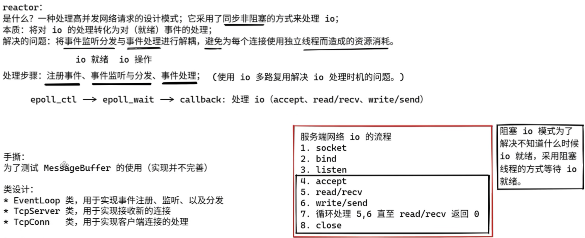

# 基于阻塞 I/O 的 TCP 客户端和服务器

服务端网络 io 的流程 ( sblarwc )

1.   socket

2.   bind 

3.   listen 

4.   accept 

5.   read/recv 

6.   write/send 

7.   循环处理 5,6直至 read/recv 返回 0 

8.   close

客户端网络 io 的流程 ( scwrc )

1.   socket
2.   connect
3.   write/send
4.   read/recv
5.   循环处理3,4直到完成通信
6.   close


--------------

### sockaddr_in 结构体

```c++
struct sockaddr_in {
    sa_family_t    sin_family; // 地址族, ipv4是AF_INET, ipv6是AF_INET6
    in_port_t      sin_port;   // 端口号 必须使用网络字节序存储, 要使用htons()转换字节序
    struct in_addr sin_addr;   // IP 地址 同样是网络字节序
    unsigned char  sin_zero[8]; // 填充字节，使其与 sockaddr 结构体大小相同, 通常使用memset将它清零
};

// 疑似逆天
// 嵌套的 in_addr 结构体定义如下：
struct in_addr {
    in_addr_t s_addr; // IPv4 地址，网络字节序
};
```


# Reactor 模型



读操作:

1.   应用程序注册读就绪事件和相关联的事件处理器

2.   事件分离器等待事件的发生

3.   当发生读就绪事件的时候, 事件分离器调用第一步注册的事件处理器

4.   事件处理器首先执行实际的读取操作, 然后根据读取到的内容进行进一步的处理


# Proactor 模型