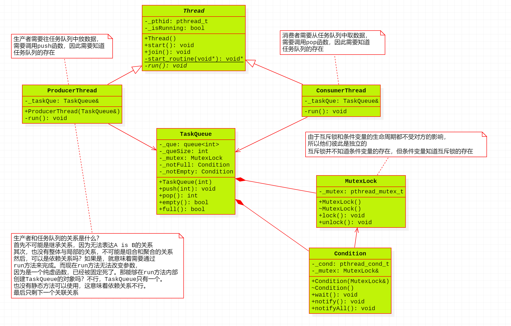

# LINUX 多线程

## 1. Linux 多线程概述

### 1.1 概述

​	 进程是系统中程序执行和资源分配的基本单位。 每个进程有自己的数据段、 代码段和堆栈段。 这就造成进程在进行切换等操作时都需要有比较多的上下文切换等动作。 为了进一步减少处理器的空转时间支持多处理器和减少上下文切换开销， 也就出现了线程。

​	 线程是操作系统能够进行运算调度的最小单位。 它被包含在进程之中， 是进程中的实际运作单位。是进程的基本调度单元， 每个进程至少都有一个 main 线程， 它与同进程中的其他线程共享进程空间｛堆代码 数据 文件描述符 信号等｝ ， 只拥有少量的栈空间， 大大减少了上下文切换的开销。

​	 线程和进程在使用上各有优缺点： 线程执行开销小， 占用的 CPU 少， 线程之间的切换快， 但不利于资源的管理和保护； 而进程正相反。

​	 同进程一样， 线程也将相关的变量值放在线程控制表（TCB） 内。 一个进程可以有多个线程， 也就是有多个线程控制表及堆栈寄存器， 共享一个用户地址空间。 要注意的是， 由于线程共享了进程的资源和地址空间， 因此， 任何线程对系统资源的操作都会给其他线程带来影响。

### 1.2 线程分类

按调度者分为用户级线程和核心级线程。

**用户级线程**：主要解决上下文切换问题， 调度算法和调度过程全部由用户决定， 在运行时不需要特定的内核支持。 缺点是无法发挥多处理器的优势

- 调度由用户控制，无需内核支持。
- 缺点：无法利用多处理器优势。

**核心级线程**：**：** 允许不同进程中的线程按照同一相对优先调度方法调度， 发挥多处理器的并发优势现在大多数系统都采用用户级线程和核心级线程并存的方法。 对应方式有：

- 多对一模型：将多个用户级线程映射到一个内核级线程；

- 一对一模型：一个用户线程映射一个内核线程；
- 多对多模型：将多个用户级线程映射到多个内核级线程， 用户级线程数量 > 核心级线程数量。

### 1.3 线程创建的 Linux 实现

Linux 的线程是通过用户级的函数库实现的， 一般采用 pthread 线程库实现线程的访问和控制。它用第 三方 posix 标准的 pthread， 具有良好的可移植性。 编译的时候要在后面加上 **–lpthread**, 注意：`ubuntu22.04`的版本不再需要了

| 操作 | 进程函数 | 线程函数           |
| ---- | -------- | ------------------ |
| 创建 | `fork()` | `pthread_create()` |
| 退出 | `exit()` | `pthread_exit()`   |
| 等待 | `wait()` | `pthread_join()`   |

---

## 2. 线程的创建和退出

​	 创建线程实际上就是确定调用该线程函数的入口点， 线程的创建采用函数 `pthread_create`。 在线程创建以后， 就开始运行相关的线程函数， 在该函数运行完之后， 线程就退出， 这也是线程退出的一种方式。另一种线程退出的方式是使用函数 `pthread_exit()`函数， 这是线程主动退出行为。 这里要注意的是， 在使用线程函数时， 不能随意使用 exit 退出函数进行出错处理， 由于 exit 的作用是使调用进程终止， 往往一个进程包括了多个线程， 所以在线程中通常使用 `pthread_exit` 函数来代替进程中的退出函数 exit。

​	 由于一个进程中的多个线程是共享数据段的， 因此通常在线程退出之后， 退出线程所占用的资源并不会随着线程的终止而得到释放。 正如进程之间可以通过 wait()函数系统调用来同步终止并释放资源一样， 线程之间也有类似的机制， 那就是 pthread_join 函数。 `pthread_join` 函数可以用于将当前线程挂起，等待线程的结束。 这个函数是一个线程阻塞函数， 调用它的函数将一直等待直到被等待的线程结束为止，当函数返回时， 被等待线程的资源被回收。

### 2.1 线程创建

```c
#include <pthread.h>
int pthread_create(pthread_t *thread, const pthread_attr_t *attr,
                   void *(*start_routine)(void *), void *arg);
// 编译时需添加 -pthread
```

### 2.2 线程退出

```c
//函数原型
#include <pthread.h>
void pthread_exit(void *retval);
```

简单的测试用例

```c
#include <head.h>
void * threadFunc(void* p)
{
	printf(" i m child \n");
	pthread_exit(NULL);
}
int main(int argc, char** argv)
{
	pthread_t thid;
	int ret = 0;
	ret = pthread_create(&thid, NULL, threadFunc, NULL);
	THREAD_ERROR_CHECK(ret, "pthread_create");
	printf("i am main thread\n");
	sleep(1);
}
```

### 2.3 获取线程id

```c
//获取线程自己的id
#include <pthread.h>
pthread_t pthread_self(void);
```

测试用例

```c
//线程处理函数传参
#include <head.h>
void* threadFunc(void *p)
{
    int retVal = *(int*)p;
    printf("i am child thread val = %d\n", retVal);
    pthread_exit(NULL);
}

int main(int argc, char** argv)
{
    pthread_t thid;
    int ret = 0;
    int val = 2;
    //向子线程里传递整型值
    ret = pthread_create(&thid, NULL, threadFunc, &val);
    THREAD_ERROR_CHECK(ret, "pthread_create");
    sleep(1);
    return 0;
}
```

## 3. 线程的等待与取消

### 3.1线程的等待

线程从入口点函数自然返回， 或者主动调用 `pthread_exit()`函数， 都可以让线程正常终止线程调用`pthread_exit()`函数返回时， 函数返回值可以被其它线程用 `pthread_join `函数获取。

```c
#include <pthread.h>
int pthread_join(pthread_t thread, void **retval);
//thid 传递 0 值时， join 返回 ESRCH 错误。
```
​	该函数是一个阻塞函数， 一直等到参数 thread 指定的线程返回； 与多进程中的 wait 或 waitpid类似。retval 是一个传出参数， 接收线程函数的返回值。 如果线程通过调用 `pthread_exit()`终止， 则`pthread_exit()`中的参数相当于自然返回值， 照样可以被其它线程用 `pthread_join` 获取到。 

该函数还有一个非常重要的作用， 由于一个进程中的多个线程共享数据段， 因此通常在一个线程退出后， 退出线程所占用的资源并不会随线程结束而释放。 如果 thread 线程类型并不是自动清理资源类型的，则 thread 线程退出后， 线程本身的资源必须通过其它线程调用 `pthread_join` 来清除,这相当于多进程程序中的 `waitpid`。

```c
#include <head.h>
void* threadFunc(void* p)
{
    printf("i am child thread\n");
    pthread_exit(NULL);
}
int main(int argc, char** argv)
{
    pthread_t thid;
    int ret = 0;
    ret = pthread_create(&thid, NULL, threadFunc, NULL);
    THREAD_ERROR_CHECK(ret, "pthread_create");
    printf("i am main thread\n");
    //线程等待函数
    ret = pthread_join(thid, NULL);
    THREAD_ERROR_CHECK(ret, "join");
    return 0
}
```


```c
//子线程使用pthread_exit函数退出，退出值被pthread_join()函数捕获、
#include <head.h>
void* threadFunc(void* p)
{
    printf("i am child thread\n");
    long ret = 3;
    pthread_exit((void*)ret);
}

int main(int argc, char** argv)
{
    pthread_t thid;
    int ret = 0;
    ret = pthread_create(&thid, NULL, threadFunc, NULL);
    THREAD_ERROR_CHECK(ret, "pthread_create");
    printf("i am main thread\n");
    //使用long类型接收子线程的退出码
    long retVal = 0;
    ret = pthread_join(thid, (void**)&retVal);
    THREAD_ERROR_CHECK(ret, "join");
    printf("retVal = %ld\n", retVal);
    return 0;
}
//pthread_join 不回收堆内存的， 只回收线程的栈内存和内核中的 struct task_struct 结构占用的内存。
```

### 3.2线程的取消（了解）

​	线程也可以被其它线程杀掉， 在 Linux 中的说法是一个线程被另一个线程取消(cancel)。 

​	线程取消的方法是一个线程向目标线程发 cancel 信号， 但是如何处理 cancel 信号则由目标线程自己决定， 目标线程或者忽略、 或者立即终止、 或者继续运行至 cancelation-point(取消点)后终止。 **默认的行为是运行到取消点。**

​	什么是取消点呢？

根据POSIX标准：一些会引起阻塞的系统调用都是取消点。不过经过测试一些非阻塞性函数也可以是取消点。可以通过 man 7 pthreads 查看，不过由于Linux线程库和C库结合的不是很好，有很多函数没有明确是否为取消点。

​	总之， 线程的取消一方面是一个线程强行杀另外一个线程， 从程序设计角度看并不是一种好的风格， 另一方面目前 Linux 本身对这方面的支持并不完善， **所以在实际应用中应该谨慎使用！！！** 

**取消函数：**

```c
#include <pthread.h>
int pthread_cancel(pthread_t thread);
```

**设置线程收到** **cancel** **信号的行为：**

```c
#include <pthread.h>
int pthread_setcancelstate(int state, int *oldstate);
//state有两种值：PTHREAD_CANCEL_ENABLE（缺省:线程可以被取消） 和
//PTHREAD_CANCEL_DISABLE(线程不可以被取消); old_state如果不为NULL则存入原来的cancel状
//态以便恢复
```

测试

```c
#include <head.h>
void* threadFunc(void* p)
{
    //设置线程收到cancel信号的行为
    pthread_setcancelstate(PTHREAD_CANCEL_DISABLE, NULL);
    printf("first print\n");
    printf("second print\n");
    pthread_exit(NULL);
}
int main(int argc, char **argv)
{
    pthread_t thid;
    pthread_create(&thid, NULL, threadFunc, NULL);
    pthread_cancel(thid);
    printf("i am main thread\n");
    pthread_join(thid, NULL);
    return 0;
}
```

**设置本线程取消动作的执行时机:**

```c
#include <pthread.h>
int pthread_setcanceltype(int type, int *oldtype);
//注:使用该函数之前，需要保证线程是可以被取消的
//type类型有两种：PTHREAD_CANCEL_DEFERRED(缺省)取消请求会被延迟，直到线程运行到取消点才
//会被取消， PTHREAD_CANCEL_ASYNCHRONOUS线程可以在任何时候被取消，无论是否运行到取消点，
//只要收到信号就立刻被取消；oldtype如果不为NULL则存入运来的取消动作类型值。
```

测试

```c
#include <head.h>
void* threadFunc(void* p)
{
    //设置线程取消动作的执行时机
    pthread_setcanceltype(PTHREAD_CANCEL_ASYNCHRONOUS, NULL);
    printf("first print\n");
    printf("second print\n");
    pthread_exit(NULL);
}

int main(int argc, char **argv)
{
    pthread_t thid;
    pthread_create(&thid, NULL, threadFunc, NULL);
    pthread_cancel(thid);
    printf("i am main thread\n");
    pthread_join(thid, NULL);
    return 0;
}
```

​	 如果代码中没有取消点，还想在某处想要收到cancel信号后终止，可以使用`pthread_testcancel()`函数在需要终止的地方调用，手动设置取消点！

**对于** **man** **不了线程的相关函数需要增加** **man** **信息 ，** **apt-get install manpages-posix-dev**

### 3.3线程终止清理函数（了解）

​	 无论是可预见的线程终止还是异常终止， 都会存在资源释放的问题， 在不考虑因运行出错而退出的前提下， 如何保证线程终止时能顺利的释放掉自己所占用的资源， 特别是锁资源， 就是一个必须考虑解决的问题。 

​	 最经常出现的情形是资源独占锁的使用；线程为了访问临界共享资源而为其加上锁， 但在访问过程中该线程被外界取消， 或者发生了中断， 则该临界资源将永远处于锁定状态得不到释放。 由于外界取消操作是不可预见的， 因此的确需要一个机制来简化用于资源释放的编程。 

​	 在 POSIX 线程 API 中提供了一个 `pthread_cleanup_push()/pthread_cleanup_pop() `函数对用于自动释放资源--从 `pthread_cleanup_push()` 的调用点到 `pthread_cleanup_pop() `之间的程序段中的终止动作都将执行 `pthread_cleanup_push() `所指定的清理函数。 API 定义如下：

```c
#include <pthread.h>
void pthread_cleanup_push(void (*routine)(void *), void *arg);
void pthread_cleanup_pop(int execute);
```

`pthread_cleanup_push()/pthread_cleanup_pop() `采用先入后出的**栈结构**管理清理函数 `void routine(void *arg)` ，函数在调用 `pthread_cleanup_push() `时压入清理函数栈， 多次对`pthread_cleanup_push() `的调用将在清理函数栈中形成一个函数链， 在执行该函数链时按照压栈的相反顺序弹出。 execute 参数表示执行到 `pthread_cleanup_pop() `时是否在弹出清理函数的同时执行该函数，为 0 表示不执行， 非 0 为执行； 这个参数并不影响异常终止时清理函数的执行。 

​	 `pthread_cleanup_push()/pthread_cleanup_pop() `是以宏方式实现的， 这是 `pthread.h` 中的宏定义：

```c
#define pthread_cleanup_push(routine, arg) \
do { \
struct __pthread_cleanup_frame __clframe \
__attribute__ ((__cleanup__ (__pthread_cleanup_routine))) \
= { .__cancel_routine = (routine), .__cancel_arg = (arg), \
.__do_it = 1 };
    
#define pthread_cleanup_pop(execute) \
__clframe.__do_it = (execute); \
} while (0)
```

**注意看源码**：`pthread_cleanup_push()`带有一个"{"， 而 `pthread_cleanup_pop()`带有一个"}"， **因此这两个函数必须成对出现，** 且必须位于程序的**同一级别的代码段中才能通过编译**。 防止{}匹配错误的问题 `pthread_cleanup_pop()` 的参数 execute 如果为非 0 值,则按栈的顺序注销掉一个原来注册的清理函数，并执行该函数； 当 `pthread_cleanup_pop()` 函数的参数为 0 时， 则清除函数不会被调用，但是会清除处于栈顶的清理函数。

测试

```c
#include <head.h>
//线程清理函数
void cleanFunc(void* p)
{
    printf("cleanFunc\n");
    free(p);
    p = NULL;
}
void* threadFunc(void* p)
{
    char *p1 = (char*)malloc(20);
    strcpy(p1, "hello");
    pthread_cleanup_push(cleanFunc, p1);
    printf("p1 = %s\n", p1);
    free(p1);
    p1 = NULL;
    printf("free sucess\n");
    pthread_cleanup_pop(0);
    pthread_exit(NULL);
}

int main(int argc, char** argv)
{
    pthread_t thid;
    int ret = 0;
    ret = pthread_create(&thid, NULL, threadFunc, NULL);
    THREAD_ERROR_CHECK(ret, "pthread_create");
    printf("i am main thread\n");
    ret = pthread_cancel(thid);
    THREAD_ERROR_CHECK(ret, "pthread_cancel");
    //线程等待函数
    ret = pthread_join(thid, NULL);
    THREAD_ERROR_CHECK(ret, "join");
    return 0;
}
```

线程调用 pthread_exit() 函数时， 也会触发弹栈， 并调用线程清理函数。

```c
#include <head.h>
//线程清理函数
void cleanFunc(void* p)
{
    printf("cleanFunc\n");
    free(p);
    p = NULL;
}

void* threadFunc(void* p)
{
    char *p1 = (char*)malloc(20);
    strcpy(p1, "hello");
    pthread_cleanup_push(cleanFunc, p1);
    printf("p1 = %s\n", p1);
    free(p1);
    p1 = NULL;
    printf("free sucess\n");
    pthread_exit(NULL);
    pthread_cleanup_pop(0);
}
int main(int argc, char** argv)
{
    pthread_t thid;
    int ret = 0;
    ret = pthread_create(&thid, NULL, threadFunc, NULL);
    THREAD_ERROR_CHECK(ret, "pthread_create");
    printf("i am main thread\n");
    /* ret = pthread_cancel(thid); */
    /* THREAD_ERROR_CHECK(ret, "pthread_cancel"); */
    //线程等待函数
    ret = pthread_join(thid, NULL);
    THREAD_ERROR_CHECK(ret, "join");
    return 0;
}
```

## 4. 线程的互斥和同步

### 4.1线程的互斥

在 Posix Thread 中定义了一套专门用于线程互斥的 mutex 函数。 mutex 是一种简单的加锁的方法来控制对共享资源的存取， 这个互斥锁只有两种状态（上锁和解锁） ， 可以把互斥锁看作某种意义上的全局变量。 **为什么需要加锁**， 就是因为多个线程共用进程的资源， 要访问的是公共区间时（全局变量） ，当一个线程访问的时候， 需要加上锁以防止另外的线程对它进行访问， **实现资源的独占**。 在一个时刻只能有一个线程掌握某个互斥锁， 拥有上锁状态的线程能够对共享资源进行操作。 若其他线程希望上锁一个已经上锁了的互斥锁， 则该线程就会挂起， 直到上锁的线程释放掉互斥锁为止。

#### 4.1.1互斥锁的创建

有两种方法创建互斥锁， 静态方式和动态方式。

```c
//静态方式：POSIX 定义了一个宏 PTHREAD_MUTEX_INITIALIZER 来静态初始化互斥锁
pthread_mutex_t mutex = PTHREAD_MUTEX_INITIALIZER;

//动态方式：采用 pthread_mutex_init()函数来初始化互斥锁
//pthread_mutex_init()原型
#include <pthread.h>
int pthread_mutex_init(pthread_mutex_t *mutex, const pthread_mutexattr_t
*mutexattr)

//方式
pthread_mutex_t mutex;
pthread_mutex_init(&mutex, NULL);
```

#### 4.1.2 互斥锁的销毁

```c
//pthread_mutex_destroy()用于注销一个互斥锁
int pthread_mutex_destroy(pthread_mutex_t *mutex);
```

销毁一个互斥锁即意味着释放它所占用的资源， 且要求锁当前处于开放状态 。

#### 4.1.3 互斥锁的属性

互斥锁的属性在创建锁的时候指定， 不同的锁类型在试图对一个已经被锁定的互斥锁加锁时表现不同也就是是否阻塞等待。 有三个值可供选择： 

- `PTHREAD_MUTEX_NORMAL`， 这是缺省值（直接写 NULL 就是表示这个缺省值），也就是普通锁(或快速锁)。 普通锁只能对一把锁连续加锁一次，否则就会阻塞，造成死锁。

- `PTHREAD_MUTEX_RECURSIVE`， 嵌套锁， 允许同一个线程对同一个锁成功获得多次， 并通过多次 unlock 解锁。 如果是不同线程请求， 则在加锁线程解锁时重新竞争。

```c
//初始化嵌套锁
pthread_mutex_t lock;
pthread_mutexattr_t mutexattr; //定义属性变量
pthread_mutexattr_init(&mutexattr) //锁属性初始化
pthread_mutexattr_settype(&mutexattr, PTHREAD_MUTEX_RECURSIVE); //设置锁的属性
pthread_mutex_init(&lock, &mutexattr);
```

- `PTHREAD_MUTEX_ERRORCHECK`， 检错锁， 如果一个锁已经被使用， 同一个线程再次请求这把锁， 则返回 `EDEADLK`， 否则与 `PTHREAD_MUTEX_TIMED_NP` 类型动作相同。 这样就保证当不允许多次加锁时不会出现最简单情况下的死锁。 如果锁的类型是快速锁， 一个线程加锁之后， 又加锁， 则此时就是死锁。

```c
//初始化检错锁
pthread_mutex_t lock;
pthread_mutexattr_t mutexattr;
pthread_mutexattr_init(&mutexattr);
pthread_mutexattr_settype(&mutexattr, PTHREAD_MUTEX_ERRORCHECK);
pthread_mutex_init(&lock, &mutexattr);
```

#### 4.1.4锁的操作

锁操作主要包括：

- 加锁： `int pthread_mutex_lock(pthread_mutex_t *mutex)`

- 解锁：`int pthread_mutex_unlock(pthread_mutex_t *mutex)`
- 测试解锁：`int pthread_mutex_trylock(pthread_mutex_t *mutex)`

不同属性的锁的加锁行为：（不论哪种类型的锁， 都不可能被两个不同的线程同时得到， 而必须等待解锁 ）

- 普通锁： **加锁，不可以连续加锁，会造成死锁**
- 嵌套锁：**可以连续加锁多次**
- 检错锁： **连续加锁会报错**

不同属性的锁的解锁行为

- 普通锁：**解锁者可以是同进程内任何线程**
- 嵌套锁：**必须由加锁者才能解锁**
- 检错锁：**必须由加锁者解锁才有效**

#### 4.1.5死锁（了解）

死锁是指多个进程因竞争资源而造成的一种僵局（互相等待） ， 若无外力作用， 这些进程都将无法向前推进。

> 死锁产生的原因：

1. 系统资源的竞争：系统资源的竞争导致系统资源不足， 以及资源分配不当， 导致死锁。
2. 进程运行推进顺序不合理：进程在运行过程中， 请求和释放资源的顺序不当， 会导致死锁。

>  死锁的四个必要条件

1. 互斥条件：一个资源每次只能被一个进程使用， 即在一段时间内某资源仅为一个进程所占有。 此
   时若有其他进程请求该资源， 则请求进程只能等待。

2. 请求与保持条件：进程已经保持了至少一个资源， 但又提出了新的资源请求， 而该资源已被其他
   进程占有， 此时请求进程被阻塞， 但对自己已获得的资源保持不放。

3. 不可剥夺条件：进程所获得的资源在未使用完毕之前， 不能被其他进程强行夺走， 即只能由获得该

   资源的进程自己来释放（只能是主动释放)。

4. 循环等待条件：若干进程间形成首尾相接循环等待资源的关系。

这四个条件是死锁的必要条件， 只要系统发生死锁， 这些条件必然成立， 而只要上述条件之一不满足， 就不会发生死锁。

>  死锁的预防

可以通过破坏死锁产生的 4 个必要条件来预防死锁， 由于资源互斥是资源使用的固有特性是无法改变的。

互斥锁的使用示例

```c
#include <head.h>
typedef struct {
    int num;
    pthread_mutex_t mutex;
}Data_t;

void* threadFunc(void* p)
{
    Data_t *pData = (Data_t*)p;
    while(1){
        pthread_mutex_lock(&pData->mutex);
        if(pData->num){
            pData->num--;
            printf("thid1 num = %d\n", pData->num);
        }
        if(0 == pData->num){
            pthread_mutex_unlock(&pData->mutex);
            break;
        }
        pthread_mutex_unlock(&pData->mutex);
        sleep(1);
	}
	pthread_exit(NULL);
}

void* threadFunc1(void* p)
{
    Data_t *pData = (Data_t*)p;
    while(1){
        pthread_mutex_lock(&pData->mutex);
        if(pData->num){
            pData->num--;
            printf("thid2 num = %d\n", pData->num);
        }
        if(0 == pData->num){
            pthread_mutex_unlock(&pData->mutex);
            break;
        }
        pthread_mutex_unlock(&pData->mutex);
        sleep(1);
    }
    pthread_exit(NULL);
}

int main(int argc, char** argv)
{
    pthread_t thid, thid1;
    int ret = 0;
    Data_t data;
    data.num = 10;
    pthread_mutex_init(&data.mutex, NULL);
    ret = pthread_create(&thid, NULL, threadFunc, &data);
    THREAD_ERROR_CHECK(ret, "pthread_create");
    ret = pthread_create(&thid1, NULL, threadFunc1, &data);
    THREAD_ERROR_CHECK(ret, "pthread_create");
    ret = pthread_join(thid, NULL);
    THREAD_ERROR_CHECK(ret, "pthread_join");
    ret = pthread_join(thid1, NULL);
    THREAD_ERROR_CHECK(ret, "pthread_join");
    pthread_mutex_destroy(&data.mutex);
    return 0;
}
```


### 4.2 线程的同步

**条件变量**是利用线程间共享的全局变量进行**同步**的一种机制， 主要包括两个动作： 一个线程等待条件变量上的条件成立而挂起； 另一个线程使条件成立（给出条件成立信号） 。 为了防止竞争， 条件变量的使用总是和一个互斥锁结合在一起。

#### 4.2.1条件变量的创建

条件变量和互斥锁一样， 都有静态、 动态两种创建方式。

```c
//静态方式使 PTHREAD_COND_INITIALIZER 常量， 如下：
pthread_cond_t cond = PTHREAD_COND_INITIALIZER;

//动态方式调用 pthread_cond_init()函数， API 定义如下：
int pthread_cond_init(pthread_cond_t *cond, pthread_condattr_t *cond_attr);
pthread_cond_t cond;
pthread_cond_init(&cond, NULL);
```

#### 4.2.2条件变量的销毁

注销一个条件变量需要调用 `pthread_cond_destroy()`， 只有在没有线程在该条件变量上等待的时候能注销这个条件变量， 否则返回 EBUSY。

```c
#include <pthread.h>
int pthread_cond_destroy(pthread_cond_t *cond);
```

#### 4.2.3条件变量的等待和激发

​	**等待条件**有两种方式： 无条件等待 pthread_cond_wait()和计时等待 pthread_cond_timedwait()；无条件等待是只要等待的条件得不到满足就一直等待，计时等待是等待一段时间后如果条件不满足就返回。

```c
int pthread_cond_wait(pthread_cond_t *cond, pthread_mutex_t *mutex);
int pthread_cond_timedwait(pthread_cond_t *cond, pthread_mutex_t *mutex,
const struct timespec *abstime);
```

​	**无论哪种等待方式， 都必须和一个互斥锁配合， 以防止多个线程同时请求的竞争条件 ；mutex互斥锁必须是普通锁 ，且等待函数内的参数的锁必须和为了互斥访问资源而加的锁是同一把锁！**

​	**激发条件**有两种形式， pthread_cond_signal()激活一个等待该条件的线程， 存在多个等待线程时按入队顺序激活其中一个； 而 pthread_cond_broadcast()则激活所有等待线程.

```c
int pthread_cond_signal(pthread_cond_t *cond);
int pthread_cond_broadcast(pthread_cond_t *cond);
```

**注意：**pthread_cond_wait()和 pthread_cond_timedwait()都被实现为取消点， 也就是说如果pthread_cond_wait()被取消， 则退出阻塞， 然后将锁状态恢复， 则此时 mutex 是保持锁定状态的，而当前线程已经被取消掉， 那么解锁的操作就会得不到执行， 此时锁得不到释放， 就会造成死锁， 因而需要定义退出回调函数来为其解锁。 

条件变量使用示例：

```c
#include <head.h>
typedef struct {
    int num;
    int flag;
    pthread_cond_t cond;
    pthread_mutex_t mutex;
}Data_t;

void* threadFunc(void* p)
{
    Data_t *pData = (Data_t*)p;
    while(1){
        pthread_mutex_lock(&pData->mutex);
        if(pData->num){
        pData->num--;
        printf("thid1 num = %d\n", pData->num);
	}
    //如果num = 0，就激活条件变量
    if(0 == pData->num){
        if(1 == pData->flag){
            pthread_mutex_unlock(&pData->mutex);
            break;
        }
    	pthread_cond_signal(&pData->cond);
    }
    pthread_mutex_unlock(&pData->mutex);
    sleep(1);
    }
    pthread_exit(NULL);
}

void* threadFunc1(void* p)
{
    Data_t *pData = (Data_t*)p;
    while(1){
        pthread_mutex_lock(&pData->mutex);
        if(pData->num){
            pData->num--;
            printf("thid2 num = %d\n", pData->num);
        }
        if(0 == pData->num){
            if(1 == pData->flag){
            pthread_mutex_unlock(&pData->mutex);
            break;
            }
            pthread_cond_signal(&pData->cond);
        }
        pthread_mutex_unlock(&pData->mutex);
        sleep(1);
    }
    pthread_exit(NULL);
}

void* threadFunc2(void* p)
{
    Data_t *pData = (Data_t*)p;
    pthread_mutex_lock(&pData->mutex);
    //等待条件变量的成立
    pthread_cond_wait(&pData->cond, &pData->mutex);
    pData->num = 6;
    pData->flag = 1;
    pthread_mutex_unlock(&pData->mutex);
    pthread_exit(NULL);
}

int main(int argc, char** argv)
{
    pthread_t thid, thid1, thid2;
    int ret = 0;
    Data_t data;
    data.num = 10;
    data.flag = 0;
    //条件变量和互斥锁的初始化
    pthread_cond_init(&data.cond, NULL);
    pthread_mutex_init(&data.mutex, NULL);
    ret = pthread_create(&thid, NULL, threadFunc, &data);
    THREAD_ERROR_CHECK(ret, "pthread_create");
    ret = pthread_create(&thid1, NULL, threadFunc1, &data);
    THREAD_ERROR_CHECK(ret, "pthread_create");
    ret = pthread_create(&thid2, NULL, threadFunc2, &data);
    THREAD_ERROR_CHECK(ret, "pthread_create");
    ret = pthread_join(thid, NULL);
    THREAD_ERROR_CHECK(ret, "pthread_join");
    ret = pthread_join(thid1, NULL);
    THREAD_ERROR_CHECK(ret, "pthread_join");
    
    ret = pthread_join(thid2, NULL);
    THREAD_ERROR_CHECK(ret, "pthread_join");
    pthread_mutex_destroy(&data.mutex);
    pthread_cond_destroy(&data.cond);
    return 0;
}
```

## 5. 线程安全

​	**线程安全**： 如果一个函数能够安全的同时被多个线程调用而得到正确的结果， 那么， 我们说这个函数是线程安全的。 简单来说线程安全就是多个线程同时执行同一段代码时， 不会出现不同的结果，我们就可以说该线程是安全的；

​	线程不安全产生的原因： 大多是因为对全局变量和静态变量的操作。

**可重入函数**： 简单来说就是可以被中断的函数， 也就是说， 可以在这个函数执行的任何时刻中断它， 转入 OS 调度下去执行另外一段代码， 而返回控制时不会出现什么错误， 反之就是不可重入函数。

​	**可重入， 并不一定要是多线程的**。 可重入只关注一个结果可再现性。 在《UNIX 环境高级编程》中， 可重入函数的概念最先是在讲信号处理函数时候提出的。 此时进程(线程)正在执行函数 fun()，在函数 fun()还未执行完的时候， 突然进程接收到一个信号 sig, 此时， 需要暂停执行 fun(),要转而执行 sig 信号的处理函数 sigFunc()， 那么， 如果在 sigFunc()中， 也恰好调用了函数 fun()， 信号的处理是以软中断的形式进行的， 那么， 当 sigFunc()执行完返回之后， CPU 会继续从 fun()被打断的地方往下执行。这里讲的比较特殊， 最好的情况是， 进程中调用了 fun()函数， 信号处理函数 sigFunc()中也调用了fun()。 如果 fun()函数是可重入的， 那么， 多次调用 fun()函数就具有可再现性。 从而，两次调用 fun()的结果是正确的预期结果。 非可重入函数， 则恰好相反。

1. 可重入概念只和函数访问的变量类型有关， 和是否使用锁没有关系。
2. 线程安全， 描述的是函数能同时被多个线程安全的调用， 并不要求调用函数的结果具有可再现性。也就是说， 多个线程同时调用该函数， 允许出现互相影响的情况， 这种情况的出现需要某些机制比如互斥锁来支持， 使之安全。

3. 可重入函数是线程安全函数的一种， 其特点在于它们被多个线程调用时， 不会引用任何共享数据。

4. 线程安全是在多个线程情况下引发的， 而可重入函数可以在只有一个线程的情况下来说。
5. 线程安全不一定是可重入的， 而可重入函数则一定是线程安全的。
6. 如果一个函数中有全局变量， 那么这个函数既不是线程安全也不是可重入的。
7. 如果将对临界资源的访问加上锁， 则这个函数是线程安全的， 但如果这个重入函数若锁还未释放则会产生死锁， 因此是不可重入的。

8. 线程安全函数能够使不同的线程访问同一块地址空间， 而可重入函数要求不同的执行流对数据的操作互不影响使结果是相同的

线程不安全示例：

```c
#include <head.h>
void* threadFunc(void* p)
{
    time_t now;
    time(&now);
    char *pTime = ctime(&now);
    printf("child pTime = %s\n", pTime);
    sleep(3);
    printf("child pTime = %s\n", pTime);
    pthread_exit(NULL);
}

int main(int argc, char** argv)
{
    pthread_t thid;
    int ret = 0;
    ret = pthread_create(&thid, NULL, threadFunc, NULL);
    sleep(2);
    time_t now;
    time(&now);
    char *pTime = ctime(&now);
    printf("main pTime = %s\n", pTime);
    pthread_join(thid, NULL);
    return 0;
}
```

## 6. 线程的封装

我们先用C++的面向对象思想来封装Linux下的线程。首先，我们画出以下的类图`Thread`。


数据成员：

> - _pthid:  线程id, 因为封装的是Linux下的POSIX线程，所以要保存一个pthread_t类型的线程id.
>
> - _isRunning: 判断线程是否在运行的标志位

成员函数：

> - Thread() : 构造函数
> - run(): 纯虚函数，用来抽象该线程要做的事儿，设计为private的，是不应该作为该类对外提供的接口
> - start(): 当调用该函数后，就会开启子线程的运行，在其中会调用pthread_create函数
> - start_routine()： 表示子线程的入口函数。
> - join(): 等待子线程运行结束。

### `Thread.hpp`头文件

```c++
#ifndef __Thread_H__
#define __Thread_H__

#include <pthread.h>

namespace wd
{

class Thread
{
public:
    Thread();
    void start();
    void join();

private:
    //该函数必须要设置为静态的， 因为非静态成员函数都有一个隐含的this指针
    //这样就不满足pthread_create函数对于线程入口函数的要求了
    //因此要将该函数设置为static的，静态成员函数没有this指针
    static void * start_routine(void*);//子线程的入口函数

    virtual void run() = 0;

private:
    pthread_t _pthid;
    bool _isRunning;
};


}//end of namespace wd

#endif
```


### `Thread.cc`实现文件

```c++
#include "Thread.hpp" // 1. 放的自定义头文件

#include <stdio.h>    // 2. C的头文件
#include <string.h>

//#include <iostream> // 3. C++头文件

//#include <log4cpp/Category.hh>  //4. 第三方库头文件

namespace wd
{

Thread::Thread()
: _pthid(0)
, _isRunning(false)
{
}

void Thread::start()
{
    //第四个参数直接传递Thread对象本身过去，交给线程的入口函数的参数
    int ret = pthread_create(&_pthid, nullptr, start_routine, this);
    if(ret !=0) {
        fprintf(stderr, "pthread_create: %s\n", strerror(ret));
        return;
    }
    _isRunning = true;
}

//参数arg是通过pthread_create的第四个参数传递过来的
void * Thread::start_routine(void* arg)
{
    //子线程要运行一个任务
    //而纯虚函数run方法是我们抽象出来的任务
    //所以这里需要调用run方法, 需要一个Thread的指针
    //因此需要通过线程的参数传递过来
    Thread * pthread = static_cast<Thread*>(arg);
    if(pthread)
        pthread->run();

    return nullptr;
}

void Thread::join()
{
    if(_isRunning) {
        pthread_join(_pthid, nullptr);
        _isRunning = false;
    }
}

}//end of namespace wd
```


## 7. 互斥锁的封装

互斥锁主要就是加锁和解锁，用面向对象的思维来封装互斥锁，将其看成是一个独立的类`MutexLock`，以下是互斥锁和条件变量的类图。


`MutexLock`的数据成员只需要一个`pthread_mutex_t`类型的变量即可。

成员函数

> - MutexLock()：构造函数，初始化一个互斥锁
> - ~MutexLock()：析构函数，销毁一个互斥锁
> - lock()：加锁
> - unlock()：解锁


### `MutexLock.hpp`头文件

```c++
#ifndef __MutexLock_H__
#define __MutexLock_H__

#include <pthread.h>

namespace wd
{

class MutexLock
{
public:
    MutexLock();
    ~MutexLock();

    void lock();
    void unlock();

    pthread_mutex_t * getMutexPtr() {   return &_mutex; }

private:
    pthread_mutex_t _mutex;
};

}//end of namespace wd

#endif
```

### `MutexLock.cc`实现文件

```c++
#include "MutexLock.hpp"
#include <iostream>
#include <pthread.h>

namespace wd
{

MutexLock::MutexLock()
{
    pthread_mutex_init(&_mutex, nullptr);
}

MutexLock::~MutexLock()
{
    pthread_mutex_destroy(&_mutex);
}

void MutexLock::lock()
{
    pthread_mutex_lock(&_mutex);
}

void MutexLock::unlock()
{
    pthread_mutex_unlock(&_mutex);
}

}//end of namespace wd
```


## 8. 条件变量的封装

以上是条件变量`Condition`类的一个封装，条件变量在使用的过程中，一定要结合一个互斥锁来使用。而在我们设计的成员函数中，当调用wait函数时，没有传递任何参数，即不能通过wait函数来传递一个互斥锁过来，因此Condition对象在构造时，需要传递一个互斥锁过来，而互斥锁是单独存在的，不能直接在`Condition`的数据成员中设计一个`MutexLock`的子对象，所以我们最终使用了一个`MutexLock`的引用来做为`Condition`的数据成员。

Condition的成员函数

> - Condition(MutexLock &)： 构造函数，初始化一个条件变量
> - ~Condition()： 析构函数， 销毁一个条件变量
> - wait()：等待条件变量
> - notify()：激发条件变量，唤醒一个等待该条件变量的线程
> - notifyAll()：激发条件变量，唤醒所有等待该条件变量的线程


### `Condition.hpp`头文件

```c++
#ifndef __Condition_H__
#define __Condition_H__
#include <pthread.h>
//#include "MutexLock.hpp"  //该头文件可以放到实现文件中去, 不需要放在这里

namespace wd
{
class MutexLock;//类的前向声明， 减少头文件的依赖
class Condition
{
public:
    Condition(MutexLock & m);
    ~Condition();

    void wait();
    void notify();
    void notifyAll();

private:
    pthread_cond_t _cond;
    MutexLock & _mutex;
};

}//end of namespace wd
#endif
```

### `Condition.cc`实现文件

```c++
#include "Condition.hpp"
#include "MutexLock.hpp"  //在实现文件中才使用MutexLock的头文件
#include <iostream>
#include <pthread.h>

namespace wd
{

Condition::Condition(MutexLock & m)
: _mutex(m)
{
    pthread_cond_init(&_cond, nullptr);
}

Condition::~Condition()
{
    pthread_cond_destroy(&_cond);
}

void Condition::wait()
{
    pthread_cond_wait(&_cond, _mutex.getMutexPtr());
}

void Condition::notify()
{
    pthread_cond_signal(&_cond);
}

void Condition::notifyAll()
{
    pthread_cond_broadcast(&_cond);
}
}//end of namespace wd
```

## 9. 生产者消费者问题

生产者消费者问题是计算机科学中经典的进程同步问题，用于描述多个进程（或线程）在共享资源上的协作关系，核心在于解决并发环境下的资源竞争与同步控制。

### 问题核心场景

- **生产者**：负责生成数据并放入共享缓冲区。
- **消费者**：负责从缓冲区取出数据并处理。
- **共享缓冲区**：有限大小的存储空间，生产者和消费者需竞争访问。

### 主要问题

- **互斥访问**：多个生产者 / 消费者同时操作缓冲区时可能导致数据不一致（如读写冲突）。
- **同步等待**：缓冲区满时生产者需等待，缓冲区空时消费者需等待，避免 “忙等待” 浪费资源。


### 面向对象的PC问题类图设计

对于生产者，我们可以用一个线程类`ProducerThread`来抽象。对于消费者，可以用一个线程类`ConsumerThread`类抽象。而共享缓冲区可以用一个类`TaskQueue`来抽象。以下是PC问题的类图设计：



PC问题的核心是要实现一个存放数据的任务队列（共享缓冲区）`TaskQueue`类，该类中存放的数据，是用一个整型数据来表示的。

### `TaskQueue.hpp`头文件

```c++
#ifndef __TaskQueue_H__
#define __TaskQueue_H__

#include "MutexLock.hpp"
#include "Condition.hpp"

#include <iostream>
#include <queue>

namespace wd
{

class TaskQueue
{
public:
    TaskQueue(size_t sz);

    bool empty() const;
    bool full() const;
    void push(int );
    int pop();
    
    int size() const {  return _que.size();}

private:
    std::queue<int> _que;
    size_t _queSize;//表示的是队列元素的最大个数
    MutexLock _mutex;
    Condition _notFull;
    Condition _notEmpty;

};

}//end of namespace wd

#endif
```

### `TaskQueue.cc`实现文件

```c++
#include "TaskQueue.hpp"
#include "MutexLock.hpp"

#include <iostream>

namespace wd
{
TaskQueue::TaskQueue(size_t sz)
: _queSize(sz)
, _mutex()
, _notFull(_mutex)
, _notEmpty(_mutex)
{
}

bool TaskQueue::empty() const
{
    return _que.size() == 0; 
}

bool TaskQueue::full() const
{
    return _que.size() == _queSize;
}

//push函数运行在生产者线程
void TaskQueue::push(int num)
{
    //autolock是一个局部对象，当push函数
    //执行结束时，一定会销毁，在销毁时就会解锁
    MutexLockGuard autolock(_mutex);
    //使用while是为了防止异常（虚假）唤醒
    while(full()) {
        _notFull.wait();
    }

    _que.push(num);//往队列中存放数据
    //通知消费者线程取数据
    _notEmpty.notify();
}

//pop函数运行在消费者线程
int TaskQueue::pop()
{
    MutexLockGuard autolock(_mutex);
    while(empty()) {
        _notEmpty.wait();
    }

    int tmp = _que.front();//从队头取数据
    _que.pop();

    //通知生产者线程放数据
    _notFull.notify();
    return tmp;
}

}//end of namespace wd
```


## 10. 线程池

线程池是一种多线程处理中的资源管理机制，通过预先创建并维护一组线程，避免频繁创建和销毁线程的开销，实现对线程资源的复用和高效管理。

### 核心作用与优势

1. 降低资源消耗

   避免频繁创建 / 销毁线程的开销（如线程创建需分配栈空间、初始化寄存器等），减少系统资源浪费。

2. 控制并发数量

   限制同时运行的线程数，防止因线程过多导致 CPU 过度切换或内存溢出。

3. 提高响应速度

   线程预先创建并处于等待状态，任务到达时可立即执行，无需等待线程创建时间。


### 面向对象的线程池类图设计


### `Threadpool.hpp`头文件

```c++
#ifndef __Threadpool_H__
#define __Threadpool_H__

#include "Thread.hpp"
#include "TaskQueue.hpp"
#include <vector>
#include <memory>

using std::vector;
using std::unique_ptr;

namespace wd
{

class Threadpool
{
    friend class WorkerThread;
public:
    Threadpool(int n, int sz);
    void start();
    void stop();
    void addTask(Task *);
private:
    void doTask();

private:
    int _threadNum;
    int _queSize;
    bool _isExit;
    vector<unique_ptr<Thread>> _threads;
    TaskQueue _taskque;
};

}//end of namespace wd
#endif
```


### `Threadpool.cc`实现文件

```c++
#include "Threadpool.hpp"
#include "WorkerThread.hpp"

#include <unistd.h>
#include <iostream>

using std::cout;
using std::endl;

namespace wd
{

Threadpool::Threadpool(int n, int sz)
: _threadNum(n)
, _queSize(sz) 
, _isExit(false) 
, _threads()  
, _taskque(_queSize) 
{
    //提前开辟空间
    _threads.reserve(_threadNum);
}

void Threadpool::start()
{
    for(int i = 0; i < _threadNum; ++i) {
        unique_ptr<Thread> up(new WorkerThread(*this));
        _threads.push_back(std::move(up));
    }

    for(auto & thread: _threads) {
        thread->start();
    }
}


//充当的是生产者的角色
void Threadpool::addTask(Task * ptask)
{
    if(ptask)
        _taskque.push(ptask);
}


//每一个子线程都要做的事儿
void Threadpool::doTask()
{
    while(!_isExit) {
        //从任务队列中获取任务
        Task * ptask = _taskque.pop();//当任务队列中没有任务时，子线程都在这里阻塞
        if(ptask) {
            ptask->process();//执行任务
        }
    }
}

//停止线程池的执行
void Threadpool::stop()
{
    //当所有的任务都执行完毕之后，再退出
    while(!_taskque.empty()) {
        //sleep(1);//如果任务队列中还有任务，需要等一等
        usleep(100);
    }


    //要让每一个子线程都正常回收
    if(!_isExit) {
        _isExit = true;

        //加上wakeup之后，防止因为任务的执行速度过快，在stop函数还没有
        //来得及将_isExit设置为true时，每一个子线程就阻塞在pop方法之上了
        //
        //调用了wakeup之后，会唤醒所有的等待的子线程
        _taskque.wakeup();

        for(auto & thread: _threads) {
            thread->join();
        }
    } 
}

}//end of namespace wd
```
