# 服务器架构模型

## 基础知识

### 数据传输过程

操作系统为了保护自己，设计了用户态、内核态两个状态。应用程序一般工作在用户态，当调用一些底层操作的时候（比如 IO 操作），就需要切换到内核态才可以进行。

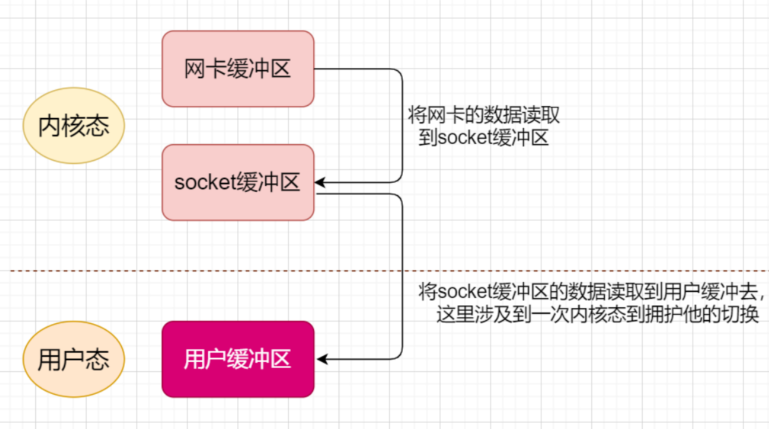

服务器从网络接收的大致流程如下：

- 数据通过计算机网络传到网卡

- 把网卡的数据读取到socket缓冲区

- 把socket缓冲区读取到用户缓冲区，之后应用程序就可以使用

这个过程的核心就是两次读取操作，下面介绍的五种网络IO 模型的不同之处也就在于这两个读取操作怎么交互。


<span style=color:red;background:yellow>**两组重要概念**</span>

<font color=red>**阻塞/非阻塞**</font>关注的是**用户态进程/线程**的状态，其要访问的数据是否就绪，进程/线程是否需要等待。当前接口数据还未准备就绪时，线程是否被阻塞挂起。何为阻塞挂起？就是当前线程还处于CPU时间片当中，调用了阻塞的方法，由于数据未准备就绪，则时间片还未到就让出CPU。而非阻塞就是当前接口数据还未准备就绪时，线程不会被阻塞挂起，可以不断轮询请求接口，看看数据是否已经准备就绪。


<font color=red>**同步/异步**</font>关注的是**消息通信机制**。

所谓同步，就是在发出一个调用时，自己需要参与等待结果的过程，则为同步。同步需要主动读写数据，在读写数据的过程中还是会阻塞。

异步IO，则指出发出调用以后到数据准备完成，自己都未参与，则为异步。异步只需要关注IO操作完成的通知，并不主动读写数据，由操作系统内核完成数据的读写。

### 五种网络IO模型（重要）

#### 阻塞式IO

应用调用recvfrom读取数据时，其系统调用直到数据包到达且被复制到应用缓冲区中或者发送错误时才返回，在此期间一直会等待，进程从调用到返回这段时间内都是被阻塞的。在内核将数据准备好之前,系统调用会一直等待。所有的套接字, 默认都是阻塞方式。

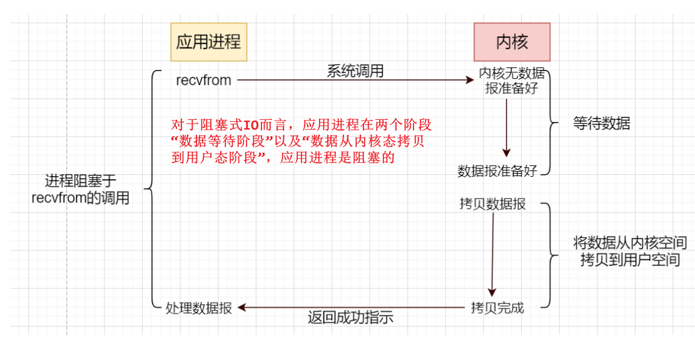

- 应用进程向内核发起recfrom读取数据
- 内核进行准备数据报（此时应用进程阻塞）
- 内核将数据从内核复制到应用空间
- 复制完成后，返回成功提示


#### 非阻塞式IO

当应用进程发起读取数据申请时，如果内核数据没有准备好会即刻告诉应用进程，不会让应用进程在这里等待,如果内核还未将数据准备好, 系统调用仍然会直接返回, 并且返回`EWOULDBLOCK`错误码。非阻塞IO往往需要程序员循环的方式反复尝试读写文件描述符。

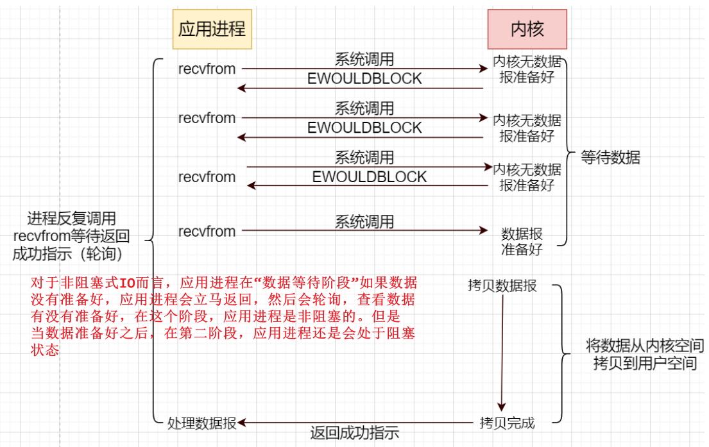

- 应用进程向内核发起recvfrom读取数据
- 内核数据报没有准备好，即刻返回`EWOULDBLOCK`错误码
- 应用进程再次向内核发起recvfrom读取数据
- 内核如果已有数据包准备好就进行下一步骤，否则还是返回错误码
- 内核将数据拷贝到用户空间
- 完成后，返回成功提示

```C++
fcntl; O_NONBLOCK;

int flags = fcntl(sockfd, F_GETFL, 0);
fcntl(sockfd, F_SETFL, flags|O_NONBLOCK);
```

#### IO多路复用

由一个线程监控多个网络请求（linux系统把所有网络请求以一个文件描述符来标识）,来完成数据状态询问的操作，当有数据准备就绪之后再分配对应的线程去读取数据。

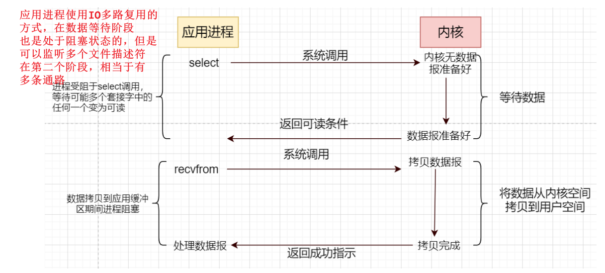

- 应用进程向内核发起recvfrom读取数据
- 内核进行准备数据报（此时应用进程阻塞）
- 内核倘若已有数据包准备好则通知应用线程
- 内核将数据拷贝到用户空间
- 完成后，返回成功提示


#### 信号驱动IO

信号驱动IO是在调用sigaction时候建立一个SIGIO的信号联系，当内核准备好数据之后再通过SIGIO信号通知线程,此文件描述符准备就绪；当线程收到可读信号后，此时再向内核发起recvfrom读取数据的请求，因为信号驱动IO的模型下，应用线程在发出信号监控后即可返回，不会阻塞，所以一个应用线程也可以同时监控多个文件描述符。

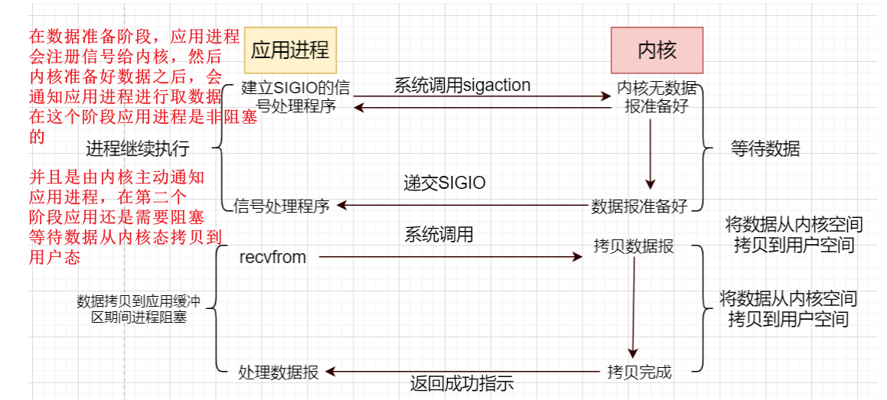

- 应用进程向内核发起recvfrom读取数据

- 内核进行准备数据报，即刻返回

- 内核倘若已有数据包准备好则通知应用线程

- 应用进程向内核发起recvfrom读取数据

- 内核将数据拷贝到用户空间

- 完成后，返回成功提示


#### 异步IO

应用进程只需要向内核发送一个读取请求，告诉内核它要读取数据后即刻返回；内核收到请求后会建立一个信号联系，当数据准备就绪，内核会主动把数据从内核空间复制到用户空间，等所有操作都完成之后，内核会发起一个通知告诉应用进程。

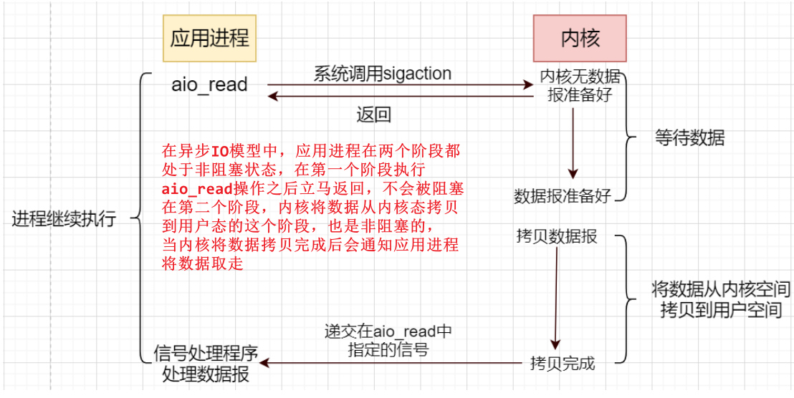

- 应用进程向内核发起recvfrom读取数据
- 内核进行准备数据报，即刻返回
- 内核收到后会建立一个信号联系，如果已有数据包准备好，内核将数据拷贝到用户空间
- 完成后，返回成功提示

#### 五种网络IO模型对比

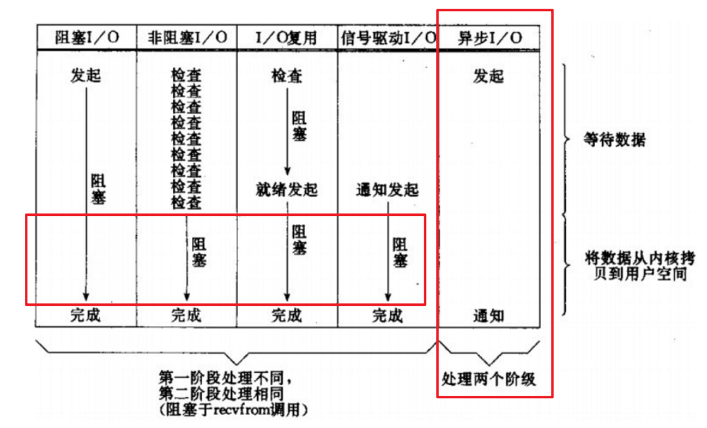


场景：小明去新华书店买《王道机试指南》

- 如果新华书店没有，就一直等着书店有了书之后才走离开 (同步阻塞)
- 如果新华书店没有，先离开书店；然后每天都去书店逛一次，直到书店到货了，买了就走 。(同步非阻塞)
- 如果新华书店没有，留下电话号码；书店有货时，老板打电话通知他，他再去书店买书。(信号驱动IO同步非阻塞)
- 如果新华书店没有，留下地址；书店有货时，老板直接把书送到家(异步非阻塞)

对应于程序：用户进程调用系统调用。**用户进程**对应小明，**内核**对应书店老板，**书**对应**数据**， 买书就是一个**系统调用**，而内核拷贝数据到进程这个过程近似于老板送书到小明手中。


## 并发服务器模型

### 循环式迭代式模型

一种单线程的应用程序，它只能使用短连接而不能使用长连接，缺点是无法充分利用多核CPU，不适合执行时间较长的服务，即适用于短连接（这样可以处理多个客户端），如果是长连接则需要在read/write之间循环，那么只能服务一个客户端。所以循环式服务器只能使用短连接，而不能使用长链接，否则无法处理多个客户端的请求，因为整个程序是一个单线程的应用程序。

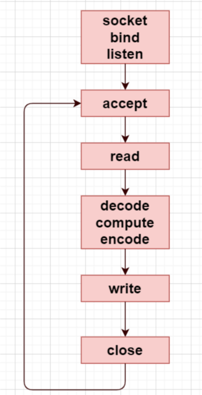


### 并发式服务器

适合执行时间比较长的服务。在父进程中要关闭创建连接的套接字，等待下一个客户端请求连接，所以可以并发式服务器处理多个客户端的请求，一个客户端一个进程；子进程在处理客户端的请求，子进程是长连接的，不断的处理请求，即使子进程中解包，计算，打包的过程时间过长，也不会影响父进程去连接其他客户端的请求。本模型也适用于线程，主线程每次accept 回来就创建一个子线程服务，由于线程共享文件描述符，故不用关闭，最后一个线程关闭监听套接字。


### prefork服务器

它处理连接的进程/线程都是预先创建好的，因此可以减小创建进程/线程的开销，能够提高响应速速。进程预先fork了n个子进程（n的数目需要提前设定），每个子进程负责和客户端的通信，每个子进程执行的都是右图的流程。前面的创建套接字，绑定端口号，监听套接字这些步骤，每个预先创建的进程已经完成，他们分别调用accept并由内核置入睡眠状态。这种服务器的优点是：提高了响应速度，不需要引入父进程执行fork的开销，新客户就能得到处理。缺点在于：每次启动服务器，父进程必须预测到底需要产生多少子进程，还有一个就是如果不考虑再派生子进程，先前派生的子进程可能被客户请求占用完，以后新到的请求只能先完成三次握手，并且达到listen接口的最大并发连接数backlog，直到有子进程可用。服务器才调用accept，将这些已经完成的连接传递给accept。

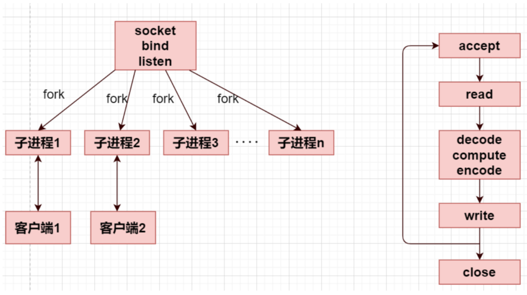


### 反应式服务器

服务器可以并发处理多个请求。不过本质上这些请求还是在一个线程中完成的，即：单线程轮询多个客户端。也无法充分利用多核CPU，不适合执行时间比较长的服务，所以为了让客户感觉是在“并发”处理而不是“循环”处理，每个请求必须在相对较短时间内执行。当然如果这个请求不能在有限的时间内完成，我们可以将这个请求拆分开来，使用有限状态机机制来完成。其中的Reactor可以使用IO多路复用

select/poll/epoll

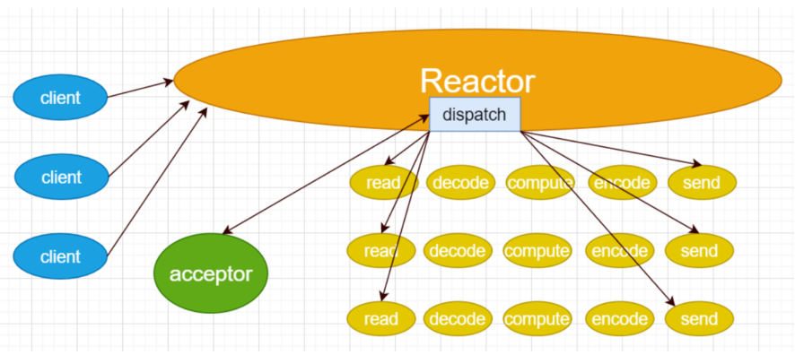

> 模型的过程解析：
>
> - Reactor是一个线程对象，该线程会启动事件循环，并使用select/poll/epoll来实现IO多路复用。注册一个Acceptor事件处理器到Reactor中，Acceptor事件处理器所关注的事件是accept事件，这样Reactor会监听客户端向服务器端发起的连接请求事件。
>
> - 客户端向服务器端发起一个连接请求，Reactor监听到了该accept事件的发生并将该accept事件派发给相应的Acceptor处理器来进行处理。Acceptor处理器通过accept方法得到与这个客户端对应的连接，然后将该连接所关注的读事件以及对应的read读事件处理器注册到Reactor中，这样Reactor就会监听该连接的read事件了。或者当你需要向客户端发送数据时，就向Reactor注册该连接的写事件和其处理器。
>
> - 当Reactor监听到有读或者写事件发生时，将调用dispatch将相关的事件分发给对应的处理器进行处理。比如，读处理器会通过read方法读取数据，此时read操作可以直接读取到数据，而不会堵塞与等待可读的数据到来。
>
> - 每当处理完所有就绪的I/O事件后，Reactor线程会再次执行IO多路复用的函数阻塞等待新的事件就绪并将其分派给对应处理器进行处理。
>
> 目前的单线程Reactor模式中，不仅I/O操作在该Reactor线程上，连非I/O的业务操作也在该线程上进行处理了，这可能会大大延迟I/O请求的响应。所以我们应该将非I/O的业务逻辑操作从Reactor线程上分离出去，以此来加速Reactor线程对I/O请求的响应。这种的服务器的并发量比并发式服务器多，因为并发式服务器能够创建的进程或者线程数目是有限的。


### 反应式 + 线程池型服务器

与单线程Reactor模式不同的是，增加了线程池对象，并将业务逻辑的处理从Reactor线程中移出转交给工作的线程池来执行。这样能够提高Reactor线程的I/O响应，不至于因为一些耗时的业务逻辑而延迟对后面I/O请求的处理。

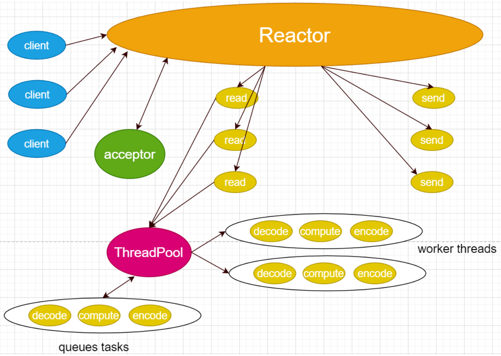

使用线程池带来的好处有如下几点：

- 线程池中的线程是提前创建好的，这样可以在处理多个请求时分摊在线程创建和销毁过程产生的巨大开销。
- 将IO操作与非IO操作分离，当请求到达时工作线程通常已经存在，因此不会由于等待创建线程而延迟任务的执行，从而提高了响应性。
- 可以进行职责分离，让IO线程做IO操作，线程池处理业务逻辑，处理大量计算，充分利用CPU的计算优势。


### 多反应式服务器

一个主线程，多个工作线程，主线程Reactor负责接收客户端连接，每个线程有各自的Reactor负责执行任务队列中的任务。


### 多反应式+ 线程池模型

多个Reactor的模式，mainReactor与subReactor都是一个线程，因为多进程之间无法共享计算线程池。这种模型能够适用IO频繁且计算密集的服务。

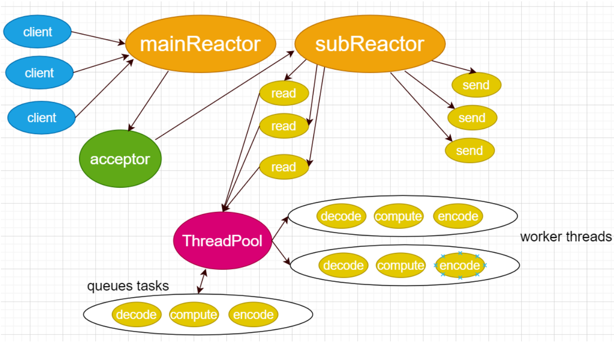

## Reactor

Reactor是后续项目使用的框架，本质就是socket网络编程+IO多路复用、Reactor + 线程池。

### ReactorV1版本

#### 类的由来

Socket类：将所有与套接字相关的操作全部封装到该类中。包括：套接字（文件描述符）的创建、文件描述符的关闭、获取文件描述符。

InetAddress类：将所有与地址相关的操作都封装到该类中。包括：通过ip与port构建对象、通过地址对象获取ip、获取端口号。

Acceptor类：连接器类，将所有基本操作全部封装到该类中。包括：地址复用、端口复用、bind、listen、accept函数。

TcpConnection类：该类的创建是由Acceptor类的对象调用accept函数得来的，也就是表明三次握手建立成功之后的结果。可以通过该连接的对象进行收发数据，发送数据的时候封装函数send，接受数据的时候封装函数receive。

SocketIO类：该类的作用就是封装所有的读写操作，也就是将读写的细节封装到该类中。封装read/recv函数以及write/send函数，将这些函数的细节封装到该类中。

#### 类图设计

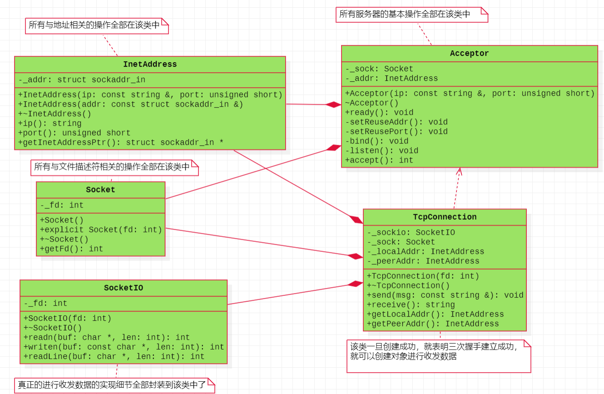


#### 重要函数

MSG_PEEK标志位

```C++
ssize_t recv(int sockfd, void *buf, size_t len, int flags);
//如果recv的第四个参数flags为0，那么recv的作用完全等同于read，会将缓冲区中的数据读取出来，并且将数据移除掉
//如果recv的第四个参数recv是MSG_PEEK的时候，只会将缓冲区中的数据拷贝出来，并不会移除

//本函数可以获取文件描述符对应的连接的本端地址，并存于第二个参数addr
int getsockname(int sockfd, struct sockaddr *addr, socklen_t *addrlen);

//本函数可以获取文件描述符对应的连接的对端地址，并存于第二个参数addr
int getpeername(int sockfd, struct sockaddr *addr, socklen_t *addrlen);
```


### ReactorV2版本

#### 类图设计

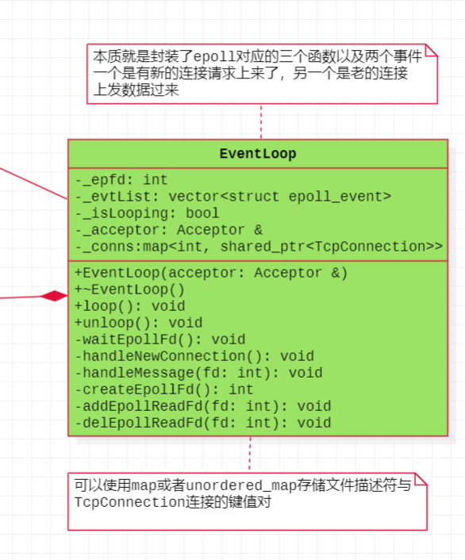

#### 伪代码

```C++
void loop()
{
    _isLooping = true;
    while(_isLooping)
    {
        waitEpollFd();
    }
}

void unloop()
{
    _isLooping = false;
}

void waitEpollFd()
{
    nready = epoll_wait(_epfd, _evtList, _evtList.size(), 3000);
    if(-1 == nready && errno == EINTR)
    {
        continue;
    }
    else if(-1 == nready)
    {
        cerr;
        return;
    }
    else if(0 == nready)
    {
        //打印超时
    }
    else
    {
        for(size_t idx = 0; idx < nready; ++idx)
        {
            if(文件描述符 == listenfd)
            {
                //有新的请求过来
                handleNewConnection();
            }
            else
            {
                //老的连接有数据发过来
                handleMessage(fd);
            }
        }
    }
}

void handleNewConnection()
{
    connfd = _acceptor.accept();
    
    TcpConnection con(connfd);//创建连接
    
    //将用于通信的文件描述符放在红黑树上进行监听
    addEpollReadFd(connfd);
    
    _conns.insert(connfd, con);//存放键值对
}

void handleMessage(int fd)
{
    it = _conns.find(fd);
    if(it != _conns.end())
    {
        msg = it->second->receive();//接受客户端的数据
        
        //处理数据
        it->second->send(msg);
    }
}
```

#### TCP网络编程过程中的三个半事件

**连接建立**：包括服务器端被动接受连接（accept）和客户端主动发起连接（connect）。TCP连接一旦建立，客户端和服务端就是平等的，可以各自收发数据。
**连接断开**：包括主动断开（close、shutdown）和被动断开（read()返回0）。
**消息到达**：文件描述符可读。这是最为重要的一个事件，对它的处理方式决定了网络编程的风格（阻塞还是非阻塞，如何处理分包，应用层的缓冲如何设计等等）。
消息发送完毕：这算半个。对于低流量的服务，可不必关心这个事件；另外，这里的“发送完毕”是指数据写入操作系统缓冲区（内核缓冲区），将由TCP协议栈负责数据的发送与重传，不代表对方已经接收到数据


#### 添加三个事件的回调（类图）

- 三个回调都是与连接相关的，所以应该直接注册给TcpConnection，但是TcpConnection的对象是在EventLoop中创建的，所以需要先将三个回调交给EventLoop，然后传递给TcpConnection对象。
- 三个会调用的形式其实就是function对象，但是为了表示都与TcpConnection相关，所以不能设置为`function<void()>`,而是需要将TcpConnection对象带上，才能表示与连接相关，所以可以设置为`function<void(const TcpConnectionPtr &)>`

#### 添加回调的类图

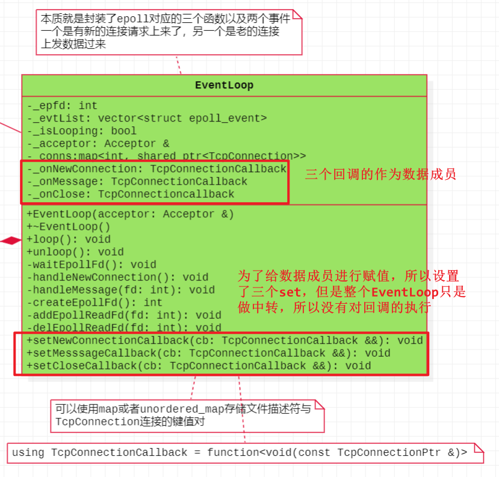

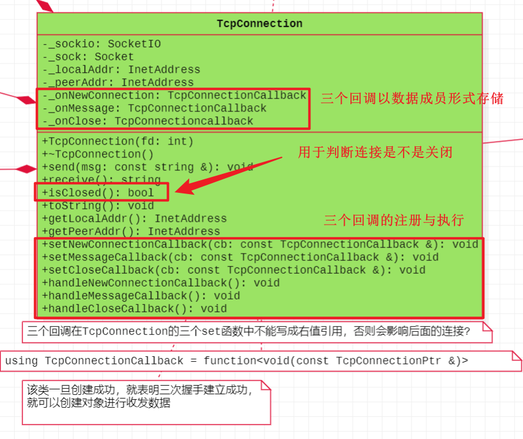

#### 重要代码（==重要==）

##### EventLoop中五个数据成员

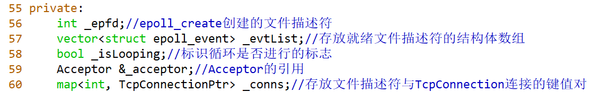

##### EventLoop中三个回调作为数据成员

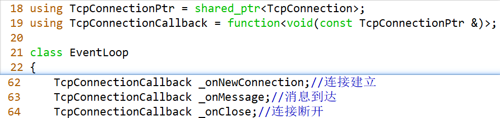

##### EventLoop中三个回调的注册

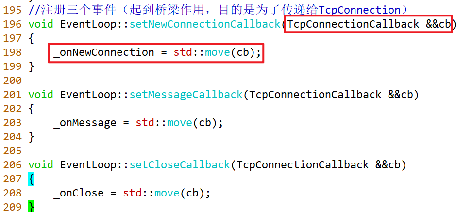

##### TcpConnection中三个回调作为数据成员

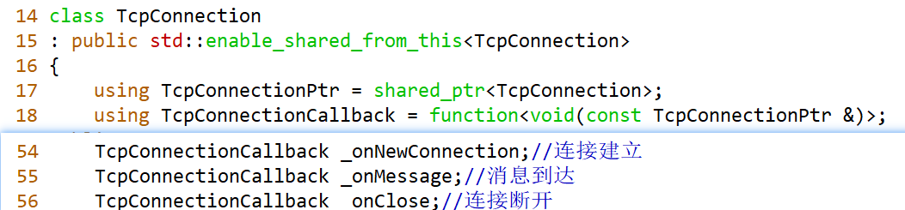

##### TcpConnection中三个回调的注册

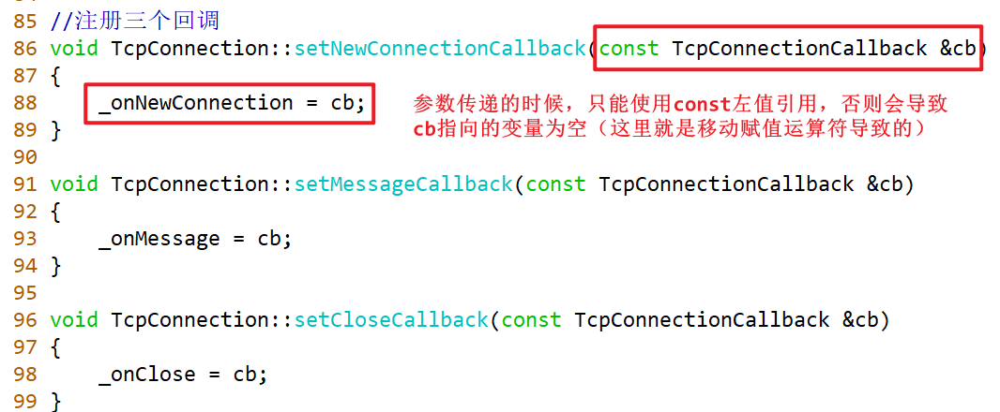

##### TcpConnection中三个回调的执行

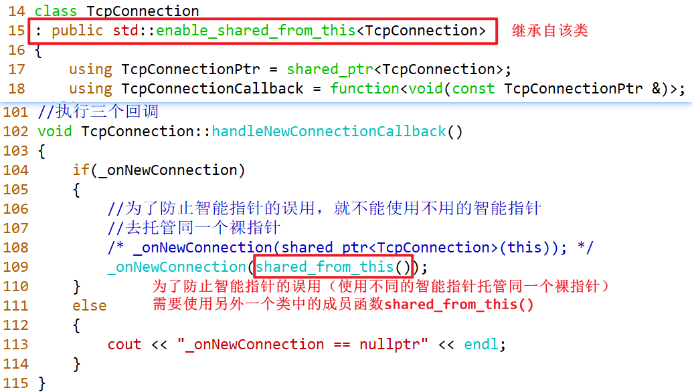

##### EventLoop中handleNewConnection的流程

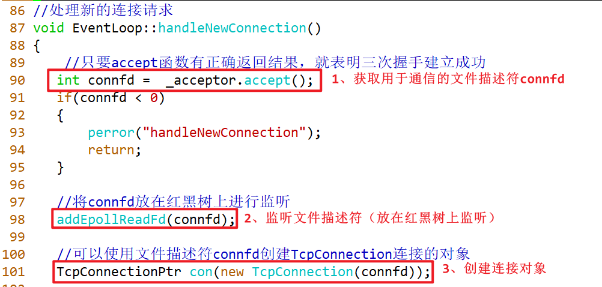

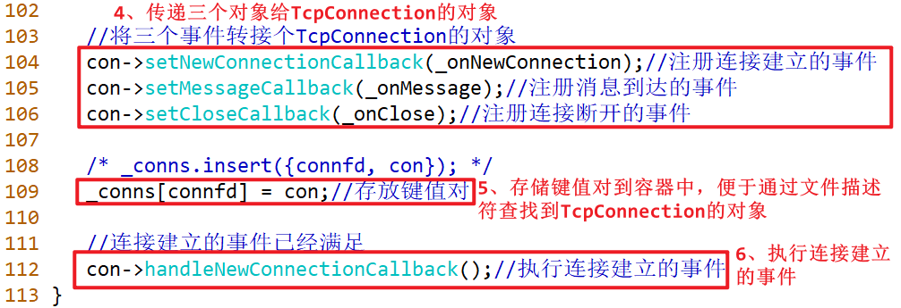


##### EventLoop中handleMessage的流程

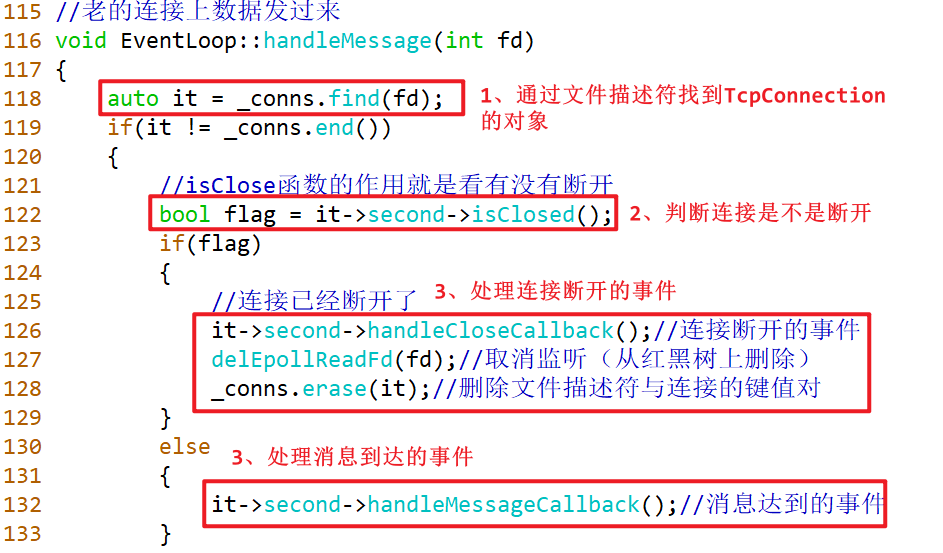


### ReactorV3版本

#### 基本Reactor原理图

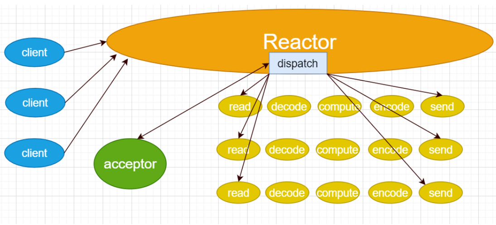

#### 类图

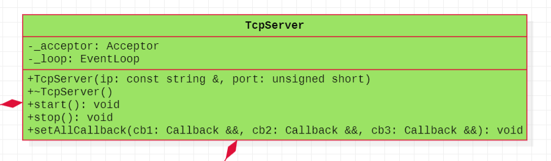

第三个版本与第二个版本没有实质的区别，就是再做了进一步封装而已。

#### 本版本的局限

- 当业务逻辑的处理比较复杂的时候，只有第一个业务处理完成并且发送之后才能处理第二个业务逻辑，也就是串行执行的，那么后面的连接处理会收到业务逻辑处理时间的瓶颈
- 所以可以将业务逻辑的处理交给线程池去做。需要将msg交给线程池，但是如果msg处理好之后，也要发送给EventLoop，而发送数据的能力只有TcpConnection，所以就将连接对象与消息都发送给线程池。
- 就是将连接TcpConnection的对象con与需要发送的数据msg打包交给MyTask，然后在MyTask的process函数处理msg这个业务逻辑。然后业务逻辑处理好之后通过con进行发送给EventLoop
- 线程池在处理好数据之后，就可以立马进行发送给EventLoop，所以需要通知EventLoop接收处理好之后的数据，也就是需要让线程池与EventLoop之间进行通信。
- 进程或者线程之间进行通信的方式有一种：eventfd


### 进线程通信方式eventfd

#### 概念

从Linux 2.6.27版本开始，新增了不少系统调用，其中包括eventfd，它的**==主要是用于进程或者线程间通信(如通知/等待机制的实现)==**  

#### 函数接口

```C++
#include <sys/eventfd.h>
int eventfd(unsigned int initval, int flags);

initval：初始化计数器值，该值保存在内核。
flags:如果是2.6.26或之前版本的内核，flags 必须设置为0。
flags支持以下标志位：
EFD_NONBLOCK 类似于使用O_NONBLOCK标志设置文件描述符。
EFD_CLOEXEC 类似open以O_CLOEXEC标志打开， O_CLOEXEC 应该表示执行exec()时，之前通过open()打开的文件描述符会自动关闭。
    
返回值：函数返回一个文件描述符，与打开的其他文件一样，可以进行读写操作
```

#### 进程间通信

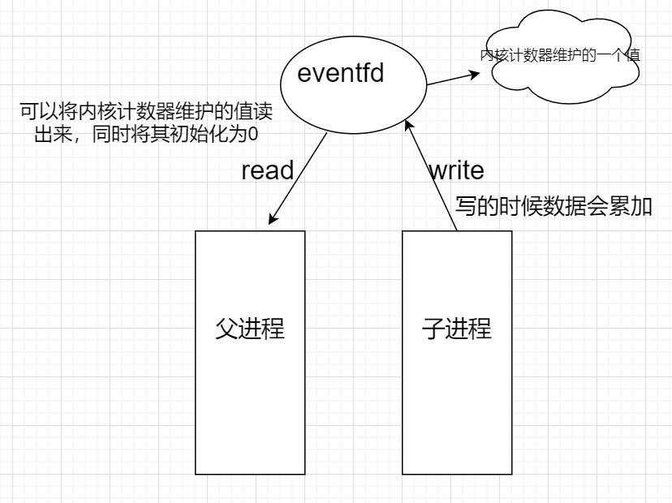

#### 线程间通信

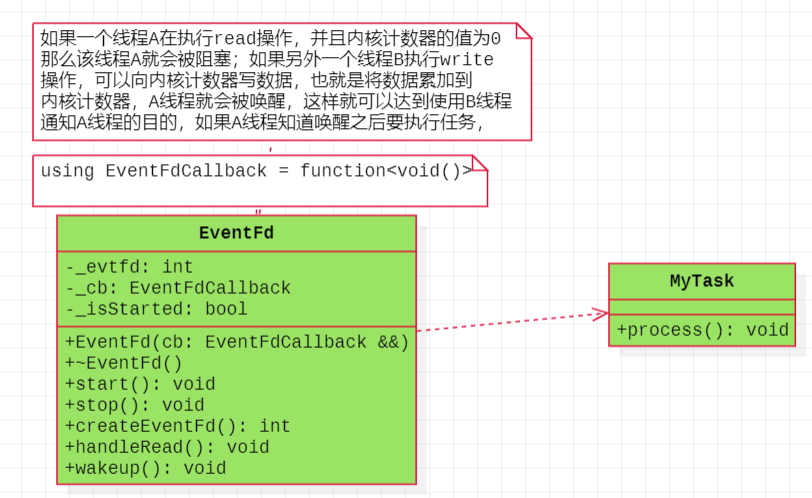

### ReactorV4版本

#### 原理图

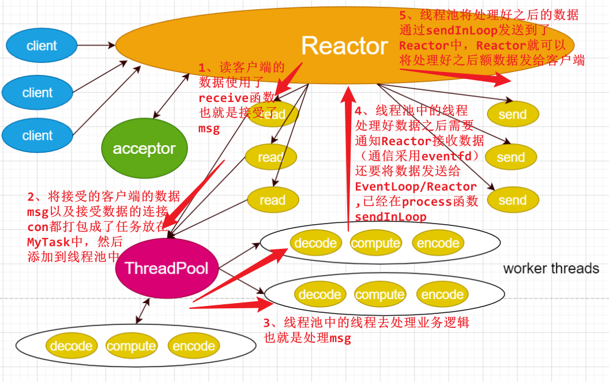

#### 类图

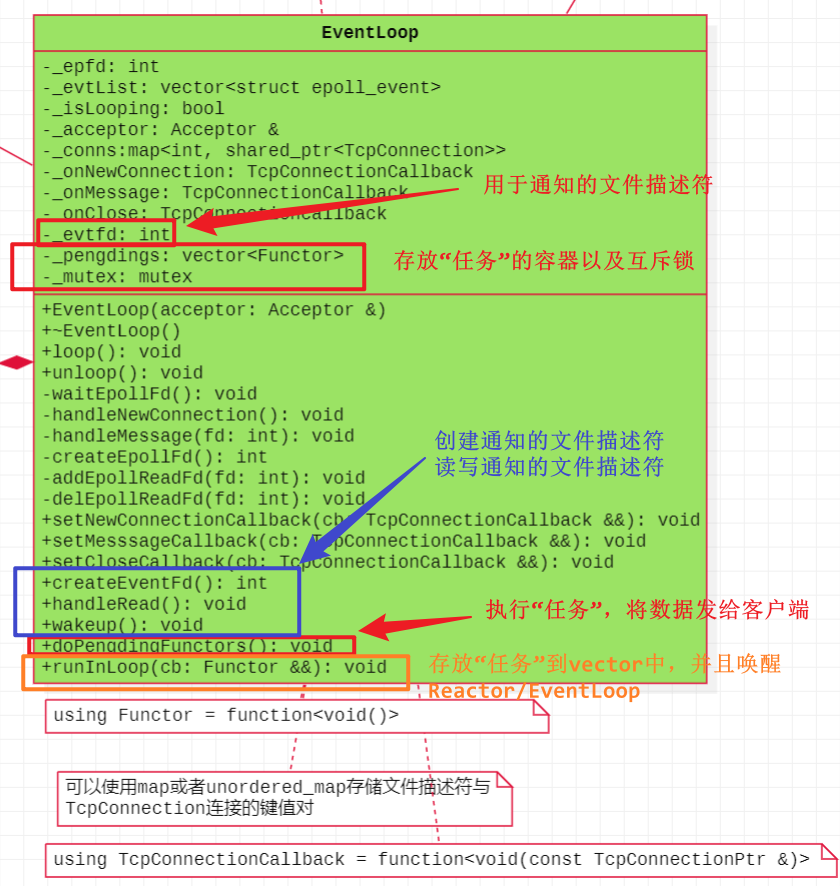

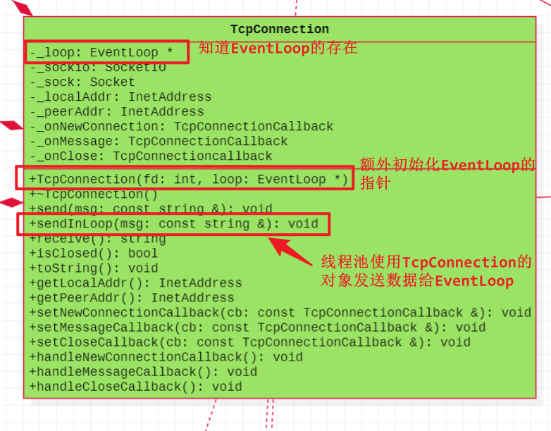

#### 流程图

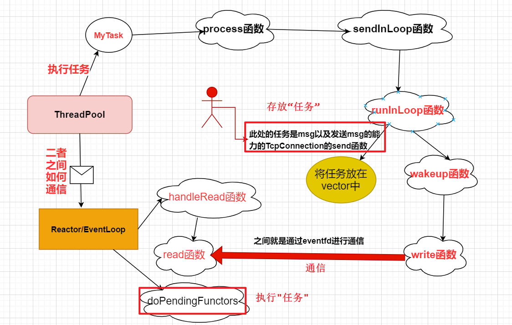


### ReactorV5版本

#### 类图

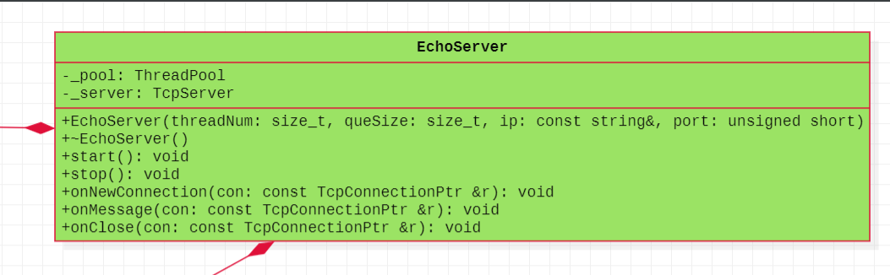

V5版本就是在V4版本的基础上解决了全局变量的问题。

#### 重要代码

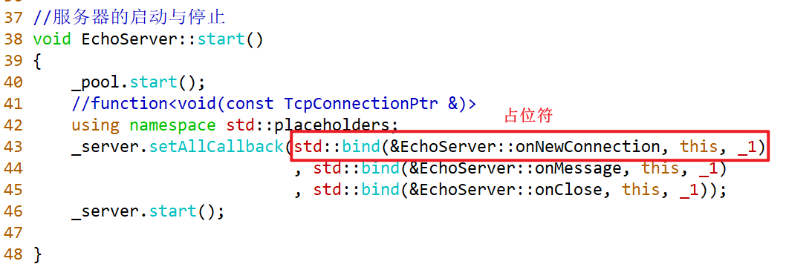

## 总结

1、将处理读写操作的线程，也就是处理IO操作的线程，称为IO线程。

2、将处理业务逻辑，也就是进行decode、compute、encode，将这类线程称为计算线程。

3、如果计算操作比较复杂，也就是可以使用Reactor + 线程池的版本，将计算操作比较复杂的模型，称为计算密集型（CPU密集型）

4、相对于线程池 + Reactor的版本，基础的Reactor版本主要在IO操作，主要可以解决IO密集的操作。


## 定时器timerfd

### 概念

timerfd是Linux提供的一个定时器接口。这个接口基于文件描述符，<font color=red>**通过文件描述符的可读事件进行超时通知**</font>（可以理解为闹钟），所以能够被用于select/poll/epoll的应用场景。timerfd是linux内核2.6.25版本中加入的接口。

### 函数接口

```C++
#include <sys/timerfd.h>
int timerfd_create(int clockid, int flags);
参数详解：
clockid:可设置为
CLOCK_REALTIME：相对时间，从1970.1.1到目前的时间。更改系统时间 会更改获取的值，它以系
统时间为标。
CLOCK_MONOTONIC：绝对时间，获取的时间为系统重启到现在的时间，更改系统时间对齐没有影响。
flags: 可设置为
TFD_NONBLOCK（非阻塞）;TFD_CLOEXEC（同O_CLOEXEC）linux内核2.6.26版本以上都指定为0

返回值：该函数生成一个定时器对象，返回与之关联的文件描述符.
    
int timerfd_settime(int fd, int flags,
                    const struct itimerspec *new_value,
                    struct itimerspec *old_value);
参数详解：
fd: timerfd对应的文件描述符
flags: 0表示是相对定时器;TFD_TIMER_ABSTIME表示是绝对定时器
new_value:设置超时时间，如果为0则表示停止定时器。
old_value:一般设为NULL, 不为NULL,则返回定时器这次设置之前的超时时间。
struct timespec
{
    time_t tv_sec; //精确到秒数
    long tv_nsec; //精确到纳秒数
};
struct itimerspec
{
    struct timespec it_interval; //定时器周期时间，前后两次超时时间差
    struct timespec it_value; //定时器起始时间，比如：12:00:00开始，或者相对某个时间点开始技时
};
返回值：该函数能够启动和停止定时器

```


### 支持的操作

定时器对象（也就是定时器创建出来的文件描述符），是可以被读以及监听的。

read函数：读取缓冲区中的数据，其占据的存储空间为sizeof(uint64_t)，表示超时次数。

select/poll/epoll：当定时器超时时，会触发定时器相对应的文件描述符上的读操作，IO多路复用操作会返回，然后再去对该读事件进行处理。

其实就是定时器对象在设置好定时操作后，当设置的超时时间到达后，定时器对象就就绪，就可以被读取了，然后当设置的超时时间到达后，定时器对象就就绪，就可以又被读取了，以此往复。


### 线程间通信

设置好定时器对象（就像设置的闹钟一样），当定时器超时后，会发出超时通知，如果线程之前在循环监视对应的文件描述符，那么文件描述符就会就绪（可读），就可以执行read函数，接下来就可以执行预先设置好的任务。当定时器后续继续超时后，监听的文件描述符会继续就绪，文件描述符继续可读，就可以继续执行任务了，所以可见，每间隔指定的时间，线程都会因为超时而被唤醒，也就达到通知的目的。那么使用面向对象封装，可以进行类图设计如下：

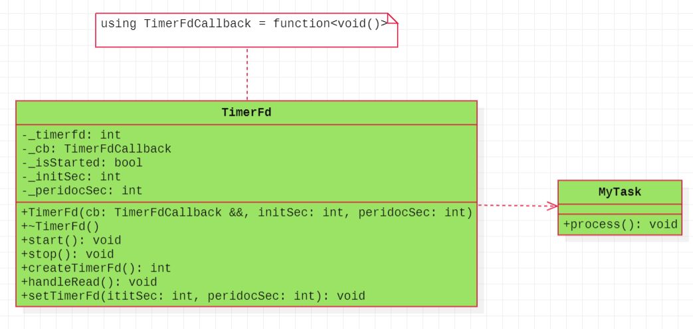

> 数据成员：
>
> - 用于超时通知的文件描述符，也就是timerfd_create创建的文件描述符 int _timerfd
>
> - 定时器初始时间与超时时间 int _initSec int _peridocSec
>
> - 被唤醒的线程需要执行的任务 TimerFdCallback _cb
>
> - 标识EventFd运行标志的标志位 bool _isStarted

> 成员函数：
>
> - start函数：该函数启动，并通过IO多路复用方式select/poll/epoll中的一种循环监视数据成员，用于超时通知的文件描述符_timerffd是不是就绪，如果就绪就可以让线程读该文件描述符并且执行被唤醒后需要执行的事件，也即是TimerFdCallback类型的任务。
>
> - stop函数：停止运行。
>
> - handleRead函数：里面封装了read函数，该函数读取timerfd_create返回的文件描述符。
>
> - setTimerFd函数：里面封装了timerfd_settime函数，用于设定定时器的起始时间与超时时间，可以是启动定时器或者关闭定时器（起始时间与超时时间都为0）


**代码实现：**

Timerfd.h

``` c++
#ifndef __TIMERFD_H__
#define __TIMERFD_H__

#include <functional>

using std::function;

class TimerFd
{
    using TimerFdCallback = function<void()>;
public:
    TimerFd(TimerFdCallback &&cb, int initSec, int peridocSec);
    ~TimerFd();

    //开始与结束
    void start();
    void stop();

    //创建用于超时的文件描述符
    int createTimerFd();

    //封装read操作
    void handleRead();

    //设置定时器
    void setTimerFd(int initSec, int peridocSec);

private:
    int _timerfd;//用于超时的文件描述符
    TimerFdCallback _cb;//被唤醒后需要执行的任务
    bool _isStarted;//标识循环是否运行的标志
    int _initSec;//定时器的起始时间
    int _peridocSec;//定时器的间隔时间（周期时间）
};

#endif
```


Timerfd.cc

``` c++
#include "TimerFd.h"
#include <unistd.h>
#include <poll.h>
#include <sys/timerfd.h>
#include <iostream>

using std::cout;
using std::endl;
using std::cerr;

TimerFd::TimerFd(TimerFdCallback &&cb, int initSec, int peridocSec)
: _timerfd(createTimerFd())
, _cb(std::move(cb))
, _isStarted(false)
, _initSec(initSec)
, _peridocSec(peridocSec)
{
}

TimerFd::~TimerFd()
{
    /* setTimerFd(0, 0); */
    close(_timerfd);
}

//开始与结束
void TimerFd::start()
{
    struct pollfd pfd;
    pfd.fd = _timerfd;//监听该文件描述符
    pfd.events = POLLIN;

    //设置定时器
    setTimerFd(_initSec, _peridocSec);

    _isStarted = true;
    while(_isStarted)
    {
        int nready = poll(&pfd, 1, 5000);
        if(-1 == nready && errno == EINTR)
        {
            continue;
        }
        else if(-1 == nready)
        {
            cerr << "-1 == nready" << endl;
            return;
        }
        else if(0 == nready)
        {
            cout << ">>poll time_out!!!" << endl;
        }
        else 
        {
            if(pfd.revents & POLLIN)
            {
                handleRead();
                if(_cb)
                {
                    _cb();//执行任务
                }
            }
        }
    }
}

void TimerFd::stop()
{
    if(_isStarted)
    {
        _isStarted = false;
        setTimerFd(0, 0);
    }
}

//创建用于超时的文件描述符
int TimerFd::createTimerFd()
{
    int fd = timerfd_create(CLOCK_REALTIME, 0);
    if(fd < 0)
    {
        perror("createTimerFd");
        return -1;
    }

    return fd;
}

//封装read操作
void TimerFd::handleRead()
{
    uint64_t one = 1;
    ssize_t ret = read(_timerfd, &one, sizeof(uint64_t));
    if(ret != sizeof(uint64_t))
    {
        perror("handleRead");
    }
}

//设置定时器
void TimerFd::setTimerFd(int initSec, int peridocSec)
{
    struct itimerspec newValue;
    newValue.it_value.tv_sec = initSec;//起始时间
    newValue.it_value.tv_nsec = 0;

    newValue.it_interval.tv_sec = peridocSec;//周期时间
    newValue.it_interval.tv_nsec = 0;

    int ret = timerfd_settime(_timerfd, 0, &newValue, nullptr);
    if(ret < 0)
    {
        perror("setTimerFd");
        return;
    }
}
```


TestTimerfd.cc

``` c++
#include "TimerFd.h"
#include <unistd.h>
#include <iostream>
#include <functional>
#include <thread>

using std::cout;
using std::endl;
using std::bind;
using std::thread;

class MyTask
{
public:
    void process()
    {
        cout << ">>MyTask is running" << endl;
    }
};

void test()
{
    MyTask task;
    TimerFd tfd(bind(&MyTask::process, &task), 1, 4);

    //A线程就是子线程，子线程中要执行read
    thread th(bind(&TimerFd::start, &tfd));//线程入口函数该怎么写呢

    sleep(30);

    tfd.stop();
    th.join();
}

int main(int argc, char *argv[])
{
    test();
    return 0;
}
```


